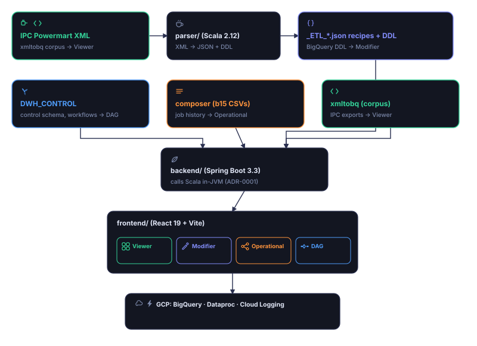

# ETL 360

ETL 360 turns Informatica PowerCenter (IPC) Powermart XML exports into browsable,
platform-agnostic ETL metadata: transformation recipes, BigQuery DDL schemas, and
Oracle→BigQuery SQL translations. It exists so that mapping logic locked inside IPC XML
can be inspected, searched, and cross-referenced without opening PowerCenter itself.

The suite is a small monorepo: a pure-Scala parser (`parser/`) that does the XML→JSON
work, a Spring Boot backend (`backend/`) that serves the parser's output plus corpus
metadata as a read-only REST API, and a React/Vite frontend (`frontend/`) that renders
it — sidebar tree, mapping detail, DOM/recipe/DDL/SQL viewers. The backend and frontend
are new (this repo's `feat/etl360-foundation` work); the parser is the original
standalone tool, unchanged in behavior.



The same artwork is clickable inside the app's landing page (each region opens the tab it
depicts); see `docs/visual-guide.md` for the full flowchart set and `docs/architecture.md`
for the precise system and sequence diagrams this illustration summarizes.

## Prerequisites

- **JDK 17+** — no JDK is preinstalled on a bare machine; install a distribution such as
  [Eclipse Temurin](https://adoptium.net/) if `java -version` doesn't already report 17+.
- **Maven 3.9+**
- **Node 22+** — 22.6+ if you run `make validate-loop`, whose sweep scripts use
  `node --experimental-strip-types`.
- **pnpm 9+**

The frontend also expects `frontend/.figma/make/site.json` to exist — it's a committed
stub (site title/description/etc. for the Figma Make plugin) that `vite.config.ts`
imports directly at config-load time. It's already checked in; Figma Make would
otherwise provision it, but nothing needs to be regenerated for local dev.

## Quick start

```bash
make dev
```

Starts the backend on `http://127.0.0.1:8080` and the frontend dev server on
`http://localhost:8443` (see `frontend/vite.config.ts` — **not** Vite's default 5173),
which proxies `/api/*` to the backend. Output from each process is prefixed
`[backend]`/`[frontend]`; Ctrl-C stops both.

`scripts/dev.sh` runs in four staged steps, each printed as `[1/4]`…`[4/4]`:
config resolution (`config.json`/`.env`/shell env/auto-detect — see "Run the 360
suite on your own data" below), backend build, backend boot (waits for
`/api/health`), then frontend boot. Pass `--check-config` to print the resolved
config table and exit without building or booting anything — a dry run:
`bash scripts/dev.sh --check-config` (there is no `make` target for this — `make dev`
doesn't forward extra arguments, and `make dev --check-config` fails with
`make: unrecognized option`, since `make` parses that flag itself).

For the build step, `scripts/dev.sh` runs `mvn -am -pl backend install -DskipTests`
and only then `(cd backend && mvn spring-boot:run)`, rather than
`mvn -am -pl backend spring-boot:run` directly — a multi-module reactor and the
`spring-boot:run` goal don't mix (invoked with `-am` across the reactor, the run goal
fans out to every module, including `parser`, and fails). Building once up front and
then running `spring-boot:run` scoped to `backend` alone avoids that.

The committed `scripts/dev.sh` now resolves JAVA_HOME and the Node `bin/` directory
itself (auto-detecting a JDK 17+ `java_home`/IDE-bundled JBR and the newest
`~/.local/toolchains/node-v*` install, both overridable via `config.json`'s
`javaHome`/`nodeBin`) — any local `JAVA_HOME`/`PATH` edits previously hand-added
inside `scripts/dev.sh` are obsolete; discard them
(`git checkout -- scripts/dev.sh` in the old main checkout).

## Make targets

| Target          | What it does                                                                 |
|-----------------|-------------------------------------------------------------------------------|
| `make dev`          | Runs backend + frontend together via `scripts/dev.sh` (Ctrl-C stops both). |
| `make test`         | `test-backend` + `test-frontend`.                                          |
| `make test-backend` | `mvn -am -pl backend test` (Java/Spring tests, incl. the corpus contract test). |
| `make test-frontend`| `cd frontend && pnpm test` (vitest).                                       |
| `make check`        | Full test suite, plus `tsc --noEmit` and `pnpm format --check`.            |
| `make build`        | `mvn package` (parser + backend jars) and `cd frontend && pnpm build`.     |
| `make regen-corpus` | Regenerates recipes/DDL over a **temp copy** of the XML corpus and diffs vs. the committed output — never writes back into the repo. See `scripts/regen_corpus.sh`. Copying its regenerated output over a committed recipe by hand can silently overwrite a recipe edited through Tab 2 (ETL Modifier)'s write API — GUI edits fork from XML and become the source of truth (ADR-0007), and `regen-corpus` doesn't know that. |
| `make generate-api` | Refreshes `frontend/src/api/types.gen.ts` from a **running** backend (`http://localhost:8080/v3/api-docs`) via `openapi-typescript`. |
| `make validate-loop` | End-to-end frontend→middleware→backend gate: boots the backend, curls `/api/health`, `/api/relationships`, `/api/operational/dates`/`{date}`, then runs the frontend hook tests. See `scripts/validate_loop.sh`. |

oxfmt 0.2.x does support `--check`, and `pnpm format --check` reaches it correctly
without needing a `--` separator (pnpm forwards trailing flags straight through to the
underlying script). The `check` target scopes its `|| true` to the `pnpm format --check`
clause only — `(pnpm format --check || true)` — so a real `tsc --noEmit` type error
still fails `make check`; only the format check is guarded. That guard is there
because the repo's formatting isn't fully clean yet (27 files as of this writing);
remove it once `cd frontend && pnpm format --check` exits 0 on its own.

## Configuration

Runtime config lives in `backend/src/main/resources/application.yml`, driven by
`ETL360_*` environment variables. Copy `.env.example` to `.env` (or export the
variables in your shell) to override defaults locally:

| Variable                  | Purpose                                                              |
|---------------------------|-----------------------------------------------------------------------|
| `ETL360_CORPUS_ROOT`      | IPC XML corpus + generated recipe/DDL JSON (default `parser/src/main/resources/xmltobq`). |
| `ETL360_DWH_CONTROL_ROOT` | Real DWH_CONTROL control-schema export (optional, git-ignored).       |
| `ETL360_MOCK_ROOT`        | Committed mock-data mirror, used as the DWH_CONTROL fallback.         |
| `ETL360_COMPOSER_ROOT`    | Composer (scheduling) export root. Falls back to a committed mock tier (14 days of synthetic b15 job history) same as DWH_CONTROL. |
| `ETL360_GCP_PROJECT`      | GCP project id for Dataproc/Logging deep links in the UI.            |
| `ETL360_GCP_REGION`       | GCP region for those same deep links.                                |

Each data root can be in one of a few modes, reported by `GET /api/config` and
`GET /api/health`:
- `ETL360_CORPUS_ROOT` — always expected present (this is the parser's own sample data).
- `ETL360_DWH_CONTROL_ROOT` — `"real"` if the real export is present, else `"mock"`
  (falls back to `ETL360_MOCK_ROOT/DWH_CONTROL`), else `"absent"`. Note: a real,
  git-ignored `DWH_CONTROL` directory predating the `LAYER_TO_LAYER/` layout (a legacy
  export) still wins the `"real"` tier, so `/api/relationships` then serves an empty
  graph (`nodes: []`) — unset or override `ETL360_DWH_CONTROL_ROOT` to see the mock
  relationships graph instead.
- `ETL360_COMPOSER_ROOT` — same real/mock/absent shape, falling back to
  `ETL360_MOCK_ROOT/composer`.

## Run the 360 suite on your own data

**Full setup guide: [`HOW_TO_RUN_ON_YOUR_DATA.md`](HOW_TO_RUN_ON_YOUR_DATA.md)** — the
single source of truth for pointing this app at your own IPC exports: prerequisites
(including corp-network specifics), the exact layout each data root must have,
generating recipes from raw XML, verifying you are on real data rather than the
synthetic fallback, and a troubleshooting table. Keep it updated when any of those
change; it lists its own source-of-truth files per section.

The short version:

```bash
git pull
cp config.example.json config.json   # git-ignored — yours to edit
$EDITOR config.json                  # point the 4 data fields at your exports
bash scripts/dev.sh --check-config   # dry run: resolved paths + real/mock mode per root
make dev                             # the same table echoes at [1/4]
```

`config.json` is **optional** — with no file at all, `make dev` boots on the committed
sample corpus and mock operational tiers. Field reference (empty string = auto-detect;
layering in `docs/adr/0009-config-json-entrypoint.md`):

| Field | Feeds | Expected layout |
|---|---|---|
| `xmltobqPath` | `ETL360_CORPUS_ROOT` | IPC XML corpus + parser output next to it |
| `composerRoot` | `ETL360_COMPOSER_ROOT` | b15 CSV history |
| `dwhControlRoot` | `ETL360_DWH_CONTROL_ROOT` | `LAYER_TO_LAYER/` statements |
| `gcpProjectId` | `ETL360_GCP_PROJECT` | project id for Dataproc/Logging deep links |
| `javaHome` | `JAVA_HOME` | JDK 17+ home (e.g. an IDE-bundled JBR) |
| `nodeBin` | `PATH` | a Node 22+ `bin/` directory |

A data root that is missing — or present but not carrying the substructure its reader
needs — falls back to the committed synthetic mock tier **silently**, so check
`dwhControlMode`/`composerMode` in `GET /api/health` before trusting what you see.
Note the inverse, too: pointing `composerRoot`/`dwhControlRoot` at the committed mock
dirs serves the same data but reports mode `real` — an explicitly configured directory
wins the real tier.

Diagrams (architecture, per-tab data flow, config resolution): `docs/visual-guide.md` —
screenshots are pending a short human capture pass, tracked as a checklist in that same
doc.

## Synthetic operational data & the b15 generator

`/api/relationships` and `/api/operational/*` are backed entirely by committed synthetic
data (never real operator exports): a mock `LayerToLayerConfig` mirror
(`backend/src/main/resources/mock/DWH_CONTROL/LAYER_TO_LAYER/<LAYER>/statements.sql`,
one INSERT per synthetic/real-corpus mapping pairing) and 14 days of b15 "application
end" job-history CSVs (`backend/src/main/resources/mock/composer/dwh/config/cluster_tuning/inputs/<YYYY_MM_DD>/`,
anchored `2026_07_16`…`2026_07_29`). Every synthetic mapping/table name carries a `SYN`
marker so it's never mistaken for production data — see
`docs/adr/0006-synthetic-operational-data.md`.

The CSV history is produced by `scripts/gen_b15_history.py` (stdlib-only Python 3) —
**never hand-edit the committed CSVs**, regenerate instead:

```bash
python3 scripts/gen_b15_history.py
```

Reads recipe names straight out of the mock `statements.sql` files, then writes one CSV
per day under `--out` (default the path above). It's fully deterministic — `random.Random(seed)`,
sorted iteration order, no wall-clock reads — so re-running with the same `--seed`
(default `360`), `--anchor` (default `2026-07-29`) and `--days` (default `14`) reproduces
the committed files byte-for-byte. To extend the window instead of just regenerating it,
give a later anchor and/or more days, e.g.:

```bash
python3 scripts/gen_b15_history.py --anchor 2026-08-05 --days 21
```

## Repo layout

```
.
├── Makefile                  # make dev|test|test-backend|test-frontend|check|build|regen-corpus|generate-api|validate-loop
├── scripts/
│   ├── dev.sh                 # backend + frontend together, Ctrl-C stops both
│   ├── regen_corpus.sh        # regenerate corpus into a temp dir, diff vs committed
│   ├── validate_loop.sh       # frontend→middleware→backend gate over the mock operational data
│   └── gen_b15_history.py     # deterministic b15 job-history CSV generator
├── HOW_TO_RUN_ON_YOUR_DATA.md   # setup guide for running on your own IPC exports
├── config.example.json          # template for config.json (git-ignored — copy it, don't edit the template)
├── .env.example                # ETL360_* env var reference
├── pom.xml                     # parent Maven aggregator (parser, backend)
├── parser/                     # Scala 2.12 IPC XML → recipe/DDL/SQL parser (standalone tool)
├── backend/                    # Spring Boot 3 / Java 17 REST API over the corpus + parser
├── frontend/                   # React 19 / Vite / TanStack Query UI
└── docs/
    ├── adr/                      # Architecture Decision Records (MADR-lite, 0000 template + 0001-0009)
    ├── architecture.md           # system diagram, endpoint table, config reference
    ├── harness.md                # the SDD/TDD harness: skills, agents, gate composition
    ├── visual-guide.md           # 4 diagrams (rendered); screenshots pending a human capture pass
    └── superpowers/
        ├── specs/               # approved design specs
        └── plans/                # implementation plans (checkbox-tracked progress)
```

`docs/architecture.md` (system diagram, sequence diagram, endpoint table, config
reference) and `docs/adr/*` (the Architecture Decision Records behind the
multi-module split, DOM+semantic overlay, mock-mirror fallback, OpenAPI-generated
types, the Figma visual contract, the synthetic operational data mock tiers,
recipes-as-source-of-truth after a GUI edit, the manifest-driven CAS mock data, and
the `config.json` entrypoint) are the reference docs for this repo's shape. For the
SDD/TDD harness these sub-projects are built with, see `docs/harness.md`; for the
suite diagrams (screenshots pending a human capture pass — see its checklist), see
`docs/visual-guide.md`. For the original
design rationale and the task-by-task build logs behind each sub-project, see
`CLAUDE.md`'s "Current spec/plan" list (grows with every sub-project — not
duplicated here).

## Corpus caveats

Everything under `parser/src/main/resources/xmltobq` is anonymized sample data, and
regenerated recipe JSON can legitimately differ from the committed copy in
anonymizer-renamed keys. See `CLAUDE.md` for the full list of corpus caveats before
treating any diff there as a bug.
