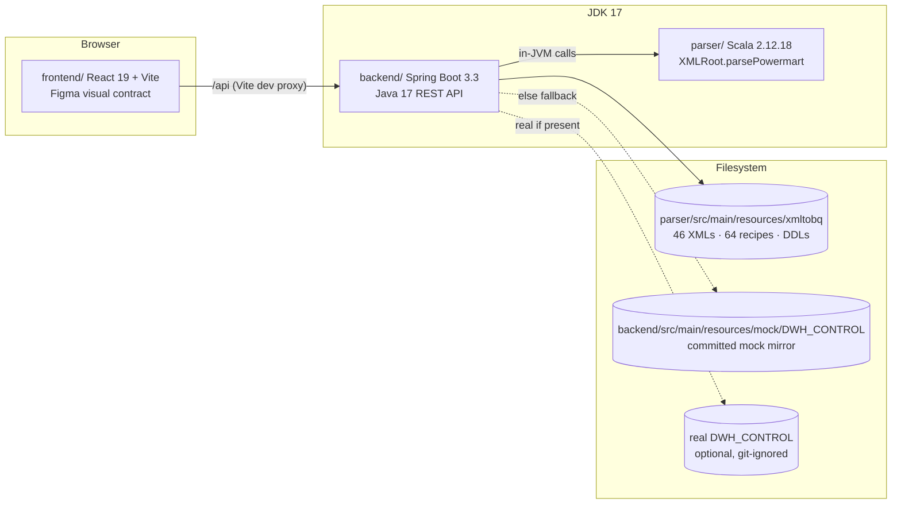
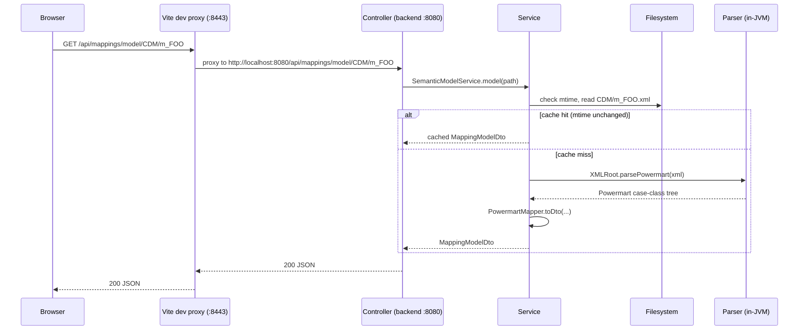

# Architecture

## Components

`parser/` is reused in-JVM (ADR-0001), not over HTTP or a subprocess. `backend/` reads
the corpus from the filesystem, not the classpath, because it's a live working
directory (generated outputs sit next to input XMLs; a later sub-project writes
recipes back).

## Request flow

Every mtime-cached service (`DomService`, and the DDL/recipe read paths) follows the
same shape: check the file's mtime against the cache entry, re-read and re-parse only
on a change. No TTL logic, no restart needed to pick up an edited file.

## Endpoints (v1, read-only)

All under `/api`, JSON, UTF-8. `{*path}` segments are corpus-relative paths without a
leading slash (e.g. `CDM/m_DM_INFOHUB_BIZLINK`). Errors are RFC 7807
`application/problem+json`.

| Endpoint | Purpose |
|---|---|
| `GET /api/tree` | Full corpus tree: layer dirs, nested folders, XML files, generated output dirs, per-node metadata (layer, size, mtime, has-recipe/has-ddl) |
| `GET /api/mappings/dom/{*path}` | Lossless generic XML→JSON: `{name, attributes, text?, children[]}` recursively |
| `GET /api/mappings/model/{*path}` | Semantic model via the in-JVM parser: repository/folder, sources, targets, mappings, mapplets, transformations, typed ports, connectors |
| `GET /api/recipes/{*path}` | Content of one `_ETL_*.json` recipe plus file metadata; preserves `SOURCE_NAME.FIELD_NAME` dot notation |
| `GET /api/ddl/{*path}` | All `<TABLE>.json` BigQuery DDL files in a mapping's output dir, keyed by table name |
| `GET /api/expressions` | Cross-corpus expression archive from XML DOMs, `origin: "xml"` (see deviation below) |
| `GET /api/config` | Sanitized runtime config: GCP project/region, Dataproc/Logging URL templates, `dwhControlMode`/`composerMode` |
| `GET /api/health` | Liveness + corpus stats: XML/recipe counts, corpus root, `dwhControlMode`, `composerMode` |

**Deviation from spec §4 table:** the mapping endpoints are `/api/mappings/dom/{*path}`
and `/api/mappings/model/{*path}` — verb before the path variable — not
`/api/mappings/{**path}/dom` as originally sketched. Spring MVC's `{*var}` ant-style
path variable must be the trailing segment of the pattern, so a fixed verb segment
can't follow it. See spec §4 "Implementation deviations" and
`docs/superpowers/plans/2026-07-29-etl360-foundation.md` Global Constraints.

HTTP status mapping: 404 `NotFoundException` ("Not found"), 400
`InvalidCorpusPathException` ("Invalid path" — path escapes corpus root or malformed),
422 `XmlUnparsableException` ("XML unparsable" — SAX failure, anonymizer-damage hint
included) or `UnreadableFileException` ("File unreadable" — malformed recipe/DDL JSON).

## Configuration

`backend/src/main/resources/application.yml`, every value overridable by an
`ETL360_*` env var (`.env.example` at repo root documents each one). Relative paths
resolve against the auto-detected repo root (first ancestor with both `pom.xml` and
`parser/`); absolute paths are taken as-is.

| Key | Env var | Default | Mode reported |
|---|---|---|---|
| `etl360.corpus-root` | `ETL360_CORPUS_ROOT` | `parser/src/main/resources/xmltobq` | always present |
| `etl360.dwh-control-root` | `ETL360_DWH_CONTROL_ROOT` | `parser/src/main/resources/DWH_CONTROL` | `real` \| `mock` \| `absent` |
| `etl360.mock-root` | `ETL360_MOCK_ROOT` | `backend/src/main/resources/mock` | fallback root for the above |
| `etl360.composer-root` | `ETL360_COMPOSER_ROOT` | `parser/src/main/resources/composer` | `real` \| `absent` (no mock tier) |
| `etl360.gcp.project-id` | `ETL360_GCP_PROJECT` | `db-dev-example-project` | — |
| `etl360.gcp.region` | `ETL360_GCP_REGION` | `europe-southwest1` | — |
| `etl360.gcp.dataproc-job-url` | (template, not overridden individually) | Dataproc job console URL pattern | — |
| `etl360.gcp.dataproc-cluster-url` | (template) | Dataproc cluster console URL pattern | — |
| `etl360.gcp.logging-url` | (template) | Cloud Logging query URL pattern | — |

`server.address: 127.0.0.1`, `server.port: 8080` — local-only, no auth, matches spec
§10 (out of scope: GCP deployment, authentication).

## See also

- `docs/adr/0001`–`0005` — the decisions behind this shape, with rejected alternatives.
- `docs/superpowers/specs/2026-07-29-etl360-foundation-design.md` — full design spec.
- `docs/superpowers/plans/2026-07-29-etl360-foundation.md` — task-by-task build log.
