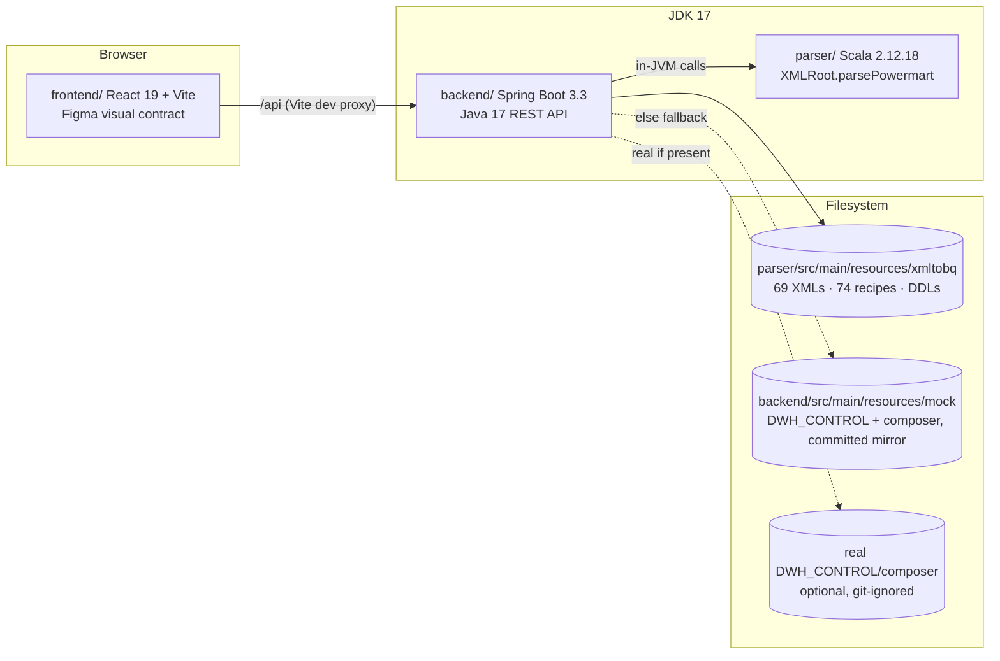
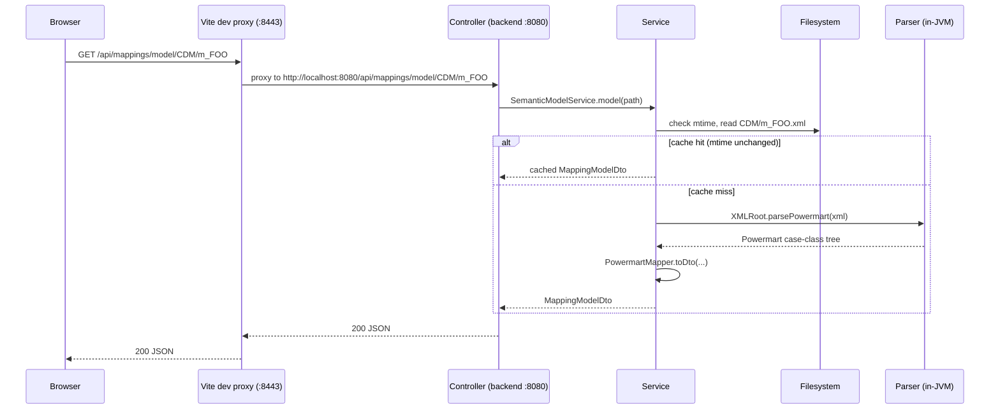

# Architecture

## Components

`parser/` is reused in-JVM (ADR-0001), not over HTTP or a subprocess. `backend/` reads
the corpus from the filesystem, not the classpath, because it's a live working
directory (generated outputs sit next to input XMLs; a later sub-project writes
recipes back).

## Request flow

Every mtime-cached service (`DomService`, and the DDL/recipe read paths) follows the
same shape: check the file's mtime against the cache entry, re-read and re-parse only
on a change. No TTL logic, no restart needed to pick up an edited file.

## Endpoints (v1)

All under `/api`, JSON, UTF-8. `{*path}` segments are corpus-relative paths without a
leading slash (e.g. `CDM/m_DM_INFOHUB_BIZLINK`). Errors are RFC 7807
`application/problem+json`.

| Endpoint | Purpose |
|---|---|
| `GET /api/tree` | Full corpus tree: layer dirs, nested folders, XML files, generated output dirs, per-node metadata (layer, size, mtime, has-recipe/has-ddl) |
| `GET /api/mappings/dom/{*path}` | Lossless generic XML→JSON: `{name, attributes, text?, children[]}` recursively |
| `GET /api/mappings/model/{*path}` | Semantic model via the in-JVM parser: repository/folder, sources, targets, mappings, mapplets, transformations, typed ports, connectors |
| `GET /api/recipes/{*path}` | Content of one `_ETL_*.json` recipe plus file metadata; preserves `SOURCE_NAME.FIELD_NAME` dot notation |
| `PUT /api/recipes/{*path}` | Saves a full recipe (`{baseModified, content}`); archives the current file to `_history/` (see note below) then writes atomically, returning the fresh `RecipeDto`. 409 if `baseModified` no longer matches the file's `modifiedAt` (stale edit) |
| `POST /api/recipes/{*path}` | **Creates** a recipe from a raw JSON body, returning the fresh `RecipeDto`. 409 if the file already exists; 400 unless the path normalizes to exactly `<layer>/<mapping>/_ETL_<mapping>.json` with `<layer>` an existing top-level directory of the corpus root (enumerated per request, never hardcoded), or unless the body validates with **zero errors** first. Creates the `<mapping>` directory only, never a layer — the sole endpoint that adds corpus files (spec §6.4) |
| `POST /api/recipes/validate` | Validates a recipe JSON body, no file IO: `{valid, errors: [{path, message}], warnings: [{path, message}], checks: [{ruleId, severity, status, path, message}]}`. `valid` stays `errors.isEmpty()` (warnings never block a save) — `errors`/`warnings` are the same `RecipeValidationErrorDto` shape; `checks` is every rule outcome (pass and fail) from the full IPC catalogue (`docs/adr/0010-ipc-conformance-ruleset.md`), driving the Tab 2 conformance chip/drawer and per-node dots |
| `GET /api/recipes/history/{*path}` | No `?version` → sorted `[{version, timestamp, sizeBytes}]` from the `_history/` sidecar; `?version=v` → that archived version as a `RecipeDto` |
| `POST /api/recipes/rollback/{*path}` | `?version=v` — archives the current file, restores the archived version, returns the fresh `RecipeDto` |
| `GET /api/ddl/{*path}` | All `<TABLE>.json` BigQuery DDL files in a mapping's output dir, keyed by table name |
| `GET /api/ipc/rules` | The IPC conformance catalogue: `{rules: [{id, severity, statement, parserRef, ipcRef, wikiRef}], typeAliases, keyAliases, keySchema: {"<source\|target>:<kind>": [{key, parserType, required, widget, ruleId}]}, connections: {"<sourceKind>": {mayFeed[], active, exactly?, namedInputs?}}}` — `keySchema` drives the Inspector and `connections` (the authored adjacency matrix, `docs/adr/0012-ipc-connection-matrix.md`) drives the pre-add config dialog's connection picker, so the GUI never hardcodes a second copy of the recipe grammar (`docs/adr/0010-ipc-conformance-ruleset.md`). `active` is nullable — unknown for `table`, `java`, `joinerInput` — and the fan-in constraint pairwise adjacency cannot express is not carried on this response at all; it is asked per candidate over `POST /api/ipc/fan-in` below |
| `POST /api/ipc/fan-in` | Evaluates `IpcConnections.fanInVerdict` for a batch of candidate connections: `{pairings: [{key, existingSourceKinds[], candidateKind}]}` → `{verdicts: {"<key>": "ok"\|"warn"\|"block"}}`. Batched because each candidate carries its own existing input group, so one picker is one request rather than one per button; `key` is the caller's own correlation id, echoed verbatim (the dialog's two pickers can offer colliding names). Raw recipe `type` tokens are canonicalized server-side through `IpcVocabulary`, so the GUI never needs a second copy of the alias table. Three-valued on purpose: only `block` may refuse a connection, `warn` means *undetermined* (a participant whose `active` is null) and is surfaced without blocking. A null, absent or empty `pairings` **field** answers `{}` rather than 4xx — this is a UI affordance, and the caller degrades by constraining nothing. (A missing request *body* is a different case: `@RequestBody` is `required = true`, so Spring rejects it before the handler and it surfaces as the global error response, not as `{}`.) See `docs/adr/0012-ipc-connection-matrix.md` |
| `GET /api/registry` | The searchable authoring inventory (spec §6.4): `{sourceTables[], targetTables[], ddlTables[], layers[]}`, each table a `{name, columns[], usedByRecipes[], variants[]}`. `columns` is a UNION across every `<TABLE>.json` sharing the name; `variants[]` is one entry per DISTINCT column set, so the 11 corpus names whose DDL files genuinely disagree can be told apart from the 169 canonical ones. Same corpus walk and `_history/`/`_layout_*` exclusions as `/api/summary` |
| `GET /api/layouts/{*path}` | Saved canvas node offsets for one recipe: `{version, nodes: {"<nodeId>": {dx, dy}}}`; `{version:1,nodes:{}}` when no `_layout_*.json` sidecar exists yet, never 404 (`docs/adr/0011-canvas-layout-sidecar.md`) |
| `PUT /api/layouts/{*path}` | Writes the layout sidecar atomically (temp file + `ATOMIC_MOVE`, mirroring the recipe write path); sandboxed via `PathResolver.insideCorpus` |
| `GET /api/summary` | Static corpus counts for the view-aware summary chip in every tab's Explorer/footer: `{xmlCount, recipeCount, ddlCount, dirCount, layers}` — same `_history`/`_layout_` exclusions as every other corpus walk |
| `GET /api/expressions` | Cross-corpus expression archive merged from two origins: `origin: "xml"` (every `TRANSFORMFIELD` EXPRESSION attribute in the mapping DOM) and `origin: "recipe"` (every recipe target field whose transformation is a call tree, walked across `CorpusService.allRecipePaths()`, `_history/` excluded) — same `ExpressionEntryDto` shape for both |
| `GET /api/relationships` | Tables+recipes graph (`RelationshipsDto { nodes, edges, meta }`) built from the mock/real `LayerToLayerConfig` joined with the corpus recipe inventory — node ids `table:<NAME>`/`recipe:<FILE>`, edge kinds `source`\|`lookup`\|`writes` |
| `GET /api/operational/dates` | Sorted list of available `YYYY-MM-DD` b15 snapshot dates + `mode` (`real`\|`mock`\|`absent`) |
| `GET /api/operational/{date}` | One dated b15 "application end" snapshot (`OperationalSnapshotDto { date, rows: [B15RowDto] }`); unknown date → 404 with nearest-available hint |
| `GET /api/operational/summary` | Cross-date rollup (`OperationalSummaryDto { dates, recipes[] }`): per-recipe `layer` (`UNKNOWN` if absent from L2L), 14-entry `history`, `okCount`/`koCount`, nearest-rank `avg`/`p50`/`p95DurationMin`, `lastJobId`/`lastClusterName` — computed in `OperationalService`, joined to `LayerToLayerService` by `recipe_filename` |
| `GET /api/config` | Sanitized runtime config: GCP project/region, Dataproc/Logging URL templates, `dwhControlMode`/`composerMode` |
| `GET /api/health` | Liveness + corpus stats: XML/recipe counts, corpus root, `dwhControlMode`, `composerMode` |
| `GET /api/diagnostics` | Data-root self-diagnosis (`docs/adr/0013-data-root-diagnostics.md`): per root the configured value, the resolved absolute path, which tier won and why the other lost. For the control schema it re-walks `LAYER_TO_LAYER/` recording **staged** counts — `presentDirs` → `filesRead` → `anchorHits` → `rowsParsed` — so the first zero identifies the failing step, plus `insertTargetsFound[]` (the `INSERT INTO <table>` identifiers actually in the files) and a one-sentence `hint`. Tab 3 renders it as an always-on tier chip and expands it under an empty graph |

Tab 1 (IPC ETL Viewer) is the first frontend consumer of the mapping endpoints: the
canvas renders from `/api/mappings/model/{*path}` (via `mappingAdapter.ts`'s
`toCanvas`), the detail panel from `/api/mappings/dom/{*path}` (lossless attributes).
Tab 2 (ETL Modifier) is the first consumer of the recipe write API: the canvas renders
from `/api/recipes/{*path}` (via `recipeAdapter.ts`'s `recipeToCanvas`), edits stage in
a local draft validated through `POST /api/recipes/validate` before `PUT`, and the
History drawer / Rollback button drive the `/api/recipes/history` and
`/api/recipes/rollback` endpoints above. Sub-project 9 added the authoring half: the
palette's pre-add dialog reads `connections` from `GET /api/ipc/rules` and its table
pickers read `GET /api/registry`, and a recipe built on a blank canvas is written with
`POST /api/recipes/{*path}` (subsequent saves are ordinary `PUT`s).

Tab 3 (ETL Operational Table Relationships): `relationshipsAdapter.ts`'s
`toOperationalGraph` combines `/api/relationships` + `/api/operational/summary` at a
selected TimePicker date into cards/edges/layer columns for the existing
`OperationalCard` graph.

Tab 4 (ETL DAG) consumes `/api/relationships` (workflow clusters + table-mediated
recipe edges via `dagAdapter.ts`) and `/api/operational/dates` +
`/api/operational/{date}` (per-run node coloring, client-side join on
`recipe_filename`).

**`_history/` sidecar.** Every `PUT` and rollback archives the recipe's prior content
to `<recipeDir>/_history/_ETL_<name>.<yyyyMMdd-HHmmss-SSS>.json` before writing —
committable, since it records the user's own edit history. `_history/` is excluded
from `/api/tree`, `CorpusService.allRecipePaths()`, DDL discovery, and the expression
walk by one shared filter (`HistorySidecar.isHistoryPath`). The same `{*path}`-trailing
constraint noted below for the mapping endpoints shapes the history/rollback URLs too
— see `docs/superpowers/specs/2026-07-31-etl-modifier-design.md` §11 "Implementation
deviations".

**Deviation from spec §4 table:** the mapping endpoints are `/api/mappings/dom/{*path}`
and `/api/mappings/model/{*path}` — verb before the path variable — not
`/api/mappings/{**path}/dom` as originally sketched. Spring MVC's `{*var}` ant-style
path variable must be the trailing segment of the pattern, so a fixed verb segment
can't follow it. See spec §4 "Implementation deviations" and
`docs/superpowers/plans/2026-07-29-etl360-foundation.md` Global Constraints.

HTTP status mapping: 404 `NotFoundException` ("Not found"), 400
`InvalidCorpusPathException` ("Invalid path" — path escapes corpus root or malformed) or
`InvalidDateException` ("Invalid date" — `/api/operational/{date}` given a non-`YYYY-MM-DD`
string), 422 `XmlUnparsableException` ("XML unparsable" — SAX failure, anonymizer-damage
hint included) or `UnreadableFileException` ("File unreadable" — malformed recipe/DDL JSON).

**Operational mock data.** `/api/relationships` is built by `RelationshipService` joining
`LayerToLayerService`'s parse of `<dwhControl>/LAYER_TO_LAYER/<LAYER>/statements.sql`
(a purpose-built tokenizer over one fixed `INSERT ... VALUES` shape, not a general SQL
parser — see ADR-0006) with the corpus recipe inventory. `/api/operational/*` is served
by `OperationalService` reading dated b15 "application end" CSV snapshots from
`<composer>/dwh/config/cluster_tuning/inputs/<YYYY_MM_DD>/`. Both the `statements.sql`
mock mirror and the 14 days of committed b15 CSVs (`2026_07_16`…`2026_07_29`) are
synthetic (`SYN`-marked mappings/tables); the CSVs are generated by
`scripts/gen_b15_history.py` — same inputs (seed, anchor, day count) always produce
byte-identical output — never hand-edited.

## Configuration

`backend/src/main/resources/application.yml`, every value overridable by an
`ETL360_*` env var (`.env.example` at repo root documents each one). Relative paths
resolve against the auto-detected repo root (first ancestor with both `pom.xml` and
`parser/`); absolute paths are taken as-is.

| Key | Env var | Default | Mode reported |
|---|---|---|---|
| `etl360.corpus-root` | `ETL360_CORPUS_ROOT` | `parser/src/main/resources/xmltobq` | always present |
| `etl360.dwh-control-root` | `ETL360_DWH_CONTROL_ROOT` | `parser/src/main/resources/DWH_CONTROL` | `real` \| `mock` \| `absent` |
| `etl360.mock-root` | `ETL360_MOCK_ROOT` | `backend/src/main/resources/mock` | fallback root for the above |
| `etl360.composer-root` | `ETL360_COMPOSER_ROOT` | `parser/src/main/resources/composer` | `real` \| `mock` \| `absent` (mock tier added sub-project 4, ADR-0006) |
| `etl360.gcp.project-id` | `ETL360_GCP_PROJECT` | `db-dev-example-project` | — |
| `etl360.gcp.region` | `ETL360_GCP_REGION` | `europe-southwest1` | — |
| `etl360.gcp.dataproc-job-url` | (template, not overridden individually) | Dataproc job console URL pattern | — |
| `etl360.gcp.dataproc-cluster-url` | (template) | Dataproc cluster console URL pattern | — |
| `etl360.gcp.logging-url` | (template) | Cloud Logging query URL pattern | — |

`server.address: 127.0.0.1`, `server.port: 8080` — local-only, no auth, matches spec
§10 (out of scope: GCP deployment, authentication).

## See also

- `docs/adr/0001`–`0012` — the decisions behind this shape, with rejected alternatives.
- `docs/superpowers/specs/2026-07-29-etl360-foundation-design.md`,
  `docs/superpowers/specs/2026-07-30-synthetic-operational-data-design.md`,
  `docs/superpowers/specs/2026-07-31-operational-casuistics-design.md`,
  `docs/superpowers/specs/2026-08-01-etl-modifier-redesign-design.md`,
  `docs/superpowers/specs/2026-08-01-etl-modifier-ux2-design.md` — full design specs.
- `docs/superpowers/plans/2026-07-29-etl360-foundation.md`,
  `docs/superpowers/plans/2026-07-30-synthetic-operational-data.md`,
  `docs/superpowers/plans/2026-07-31-operational-casuistics.md`,
  `docs/superpowers/plans/2026-08-01-etl-modifier-redesign.md`,
  `docs/superpowers/plans/2026-08-01-etl-modifier-ux2.md` — task-by-task build logs.
