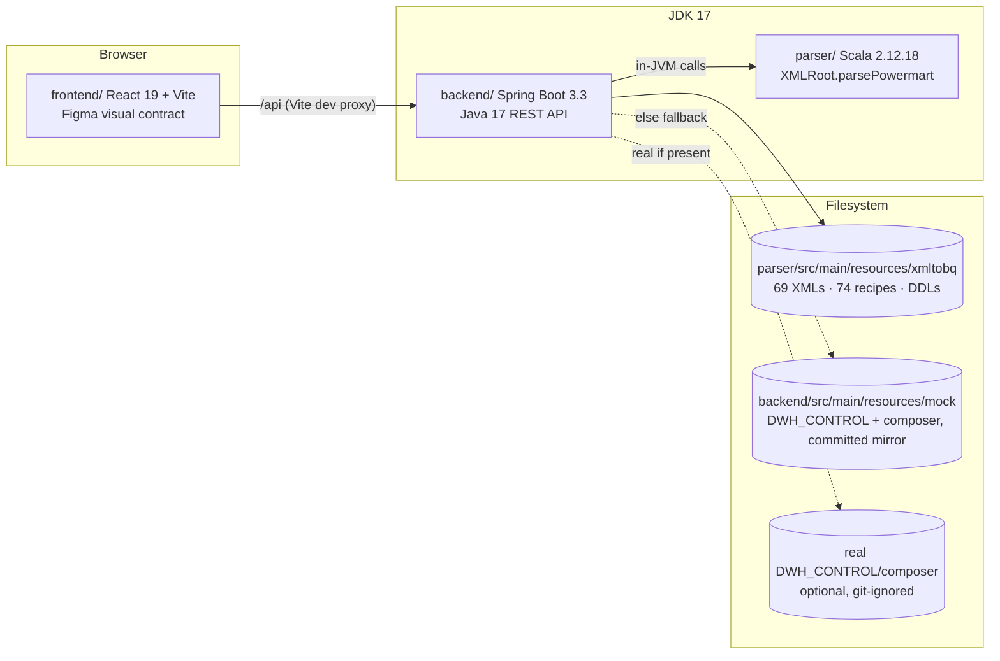
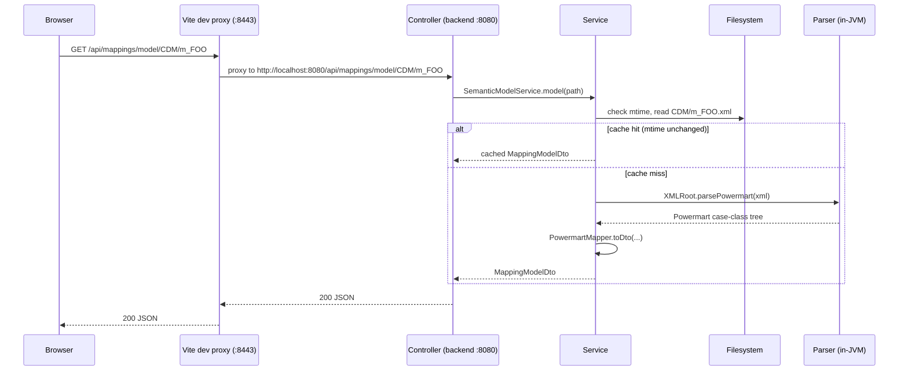

# Architecture

## Components

`parser/` is reused in-JVM (ADR-0001), not over HTTP or a subprocess. `backend/` reads
the corpus from the filesystem, not the classpath, because it's a live working
directory (generated outputs sit next to input XMLs; a later sub-project writes
recipes back).

## Request flow

Every mtime-cached service (`DomService`, and the DDL/recipe read paths) follows the
same shape: check the file's mtime against the cache entry, re-read and re-parse only
on a change. No TTL logic, no restart needed to pick up an edited file.

## Endpoints (v1, read-only)

All under `/api`, JSON, UTF-8. `{*path}` segments are corpus-relative paths without a
leading slash (e.g. `CDM/m_DM_INFOHUB_BIZLINK`). Errors are RFC 7807
`application/problem+json`.

| Endpoint | Purpose |
|---|---|
| `GET /api/tree` | Full corpus tree: layer dirs, nested folders, XML files, generated output dirs, per-node metadata (layer, size, mtime, has-recipe/has-ddl) |
| `GET /api/mappings/dom/{*path}` | Lossless generic XML→JSON: `{name, attributes, text?, children[]}` recursively |
| `GET /api/mappings/model/{*path}` | Semantic model via the in-JVM parser: repository/folder, sources, targets, mappings, mapplets, transformations, typed ports, connectors |
| `GET /api/recipes/{*path}` | Content of one `_ETL_*.json` recipe plus file metadata; preserves `SOURCE_NAME.FIELD_NAME` dot notation |
| `GET /api/ddl/{*path}` | All `<TABLE>.json` BigQuery DDL files in a mapping's output dir, keyed by table name |
| `GET /api/expressions` | Cross-corpus expression archive from XML DOMs, `origin: "xml"` (see deviation below) |
| `GET /api/relationships` | Tables+recipes graph (`RelationshipsDto { nodes, edges, meta }`) built from the mock/real `LayerToLayerConfig` joined with the corpus recipe inventory — node ids `table:<NAME>`/`recipe:<FILE>`, edge kinds `source`\|`lookup`\|`writes` |
| `GET /api/operational/dates` | Sorted list of available `YYYY-MM-DD` b15 snapshot dates + `mode` (`real`\|`mock`\|`absent`) |
| `GET /api/operational/{date}` | One dated b15 "application end" snapshot (`OperationalSnapshotDto { date, rows: [B15RowDto] }`); unknown date → 404 with nearest-available hint |
| `GET /api/operational/summary` | Cross-date rollup (`OperationalSummaryDto { dates, recipes[] }`): per-recipe `layer` (`UNKNOWN` if absent from L2L), 14-entry `history`, `okCount`/`koCount`, nearest-rank `avg`/`p50`/`p95DurationMin`, `lastJobId`/`lastClusterName` — computed in `OperationalService`, joined to `LayerToLayerService` by `recipe_filename` |
| `GET /api/config` | Sanitized runtime config: GCP project/region, Dataproc/Logging URL templates, `dwhControlMode`/`composerMode` |
| `GET /api/health` | Liveness + corpus stats: XML/recipe counts, corpus root, `dwhControlMode`, `composerMode` |

Tab 1 (IPC ETL Viewer) is the first frontend consumer of the mapping endpoints: the
canvas renders from `/api/mappings/model/{*path}` (via `mappingAdapter.ts`'s
`toCanvas`), the detail panel from `/api/mappings/dom/{*path}` (lossless attributes).
Tab 3 (ETL Operational Table Relationships) is real too: `relationshipsAdapter.ts`'s
`toOperationalGraph` combines `/api/relationships` + `/api/operational/summary` at a
selected TimePicker date into cards/edges/layer columns for the existing
`OperationalCard` graph — the `OPERATIONAL_CARDS` mock now serves only Tab 4 (DAG).

**Deviation from spec §4 table:** the mapping endpoints are `/api/mappings/dom/{*path}`
and `/api/mappings/model/{*path}` — verb before the path variable — not
`/api/mappings/{**path}/dom` as originally sketched. Spring MVC's `{*var}` ant-style
path variable must be the trailing segment of the pattern, so a fixed verb segment
can't follow it. See spec §4 "Implementation deviations" and
`docs/superpowers/plans/2026-07-29-etl360-foundation.md` Global Constraints.

HTTP status mapping: 404 `NotFoundException` ("Not found"), 400
`InvalidCorpusPathException` ("Invalid path" — path escapes corpus root or malformed) or
`InvalidDateException` ("Invalid date" — `/api/operational/{date}` given a non-`YYYY-MM-DD`
string), 422 `XmlUnparsableException` ("XML unparsable" — SAX failure, anonymizer-damage
hint included) or `UnreadableFileException` ("File unreadable" — malformed recipe/DDL JSON).

**Operational mock data.** `/api/relationships` is built by `RelationshipService` joining
`LayerToLayerService`'s parse of `<dwhControl>/LAYER_TO_LAYER/<LAYER>/statements.sql`
(a purpose-built tokenizer over one fixed `INSERT ... VALUES` shape, not a general SQL
parser — see ADR-0006) with the corpus recipe inventory. `/api/operational/*` is served
by `OperationalService` reading dated b15 "application end" CSV snapshots from
`<composer>/dwh/config/cluster_tuning/inputs/<YYYY_MM_DD>/`. Both the `statements.sql`
mock mirror and the 14 days of committed b15 CSVs (`2026_07_16`…`2026_07_29`) are
synthetic (`SYN`-marked mappings/tables); the CSVs are generated by
`scripts/gen_b15_history.py` — same inputs (seed, anchor, day count) always produce
byte-identical output — never hand-edited.

## Configuration

`backend/src/main/resources/application.yml`, every value overridable by an
`ETL360_*` env var (`.env.example` at repo root documents each one). Relative paths
resolve against the auto-detected repo root (first ancestor with both `pom.xml` and
`parser/`); absolute paths are taken as-is.

| Key | Env var | Default | Mode reported |
|---|---|---|---|
| `etl360.corpus-root` | `ETL360_CORPUS_ROOT` | `parser/src/main/resources/xmltobq` | always present |
| `etl360.dwh-control-root` | `ETL360_DWH_CONTROL_ROOT` | `parser/src/main/resources/DWH_CONTROL` | `real` \| `mock` \| `absent` |
| `etl360.mock-root` | `ETL360_MOCK_ROOT` | `backend/src/main/resources/mock` | fallback root for the above |
| `etl360.composer-root` | `ETL360_COMPOSER_ROOT` | `parser/src/main/resources/composer` | `real` \| `mock` \| `absent` (mock tier added sub-project 4, ADR-0006) |
| `etl360.gcp.project-id` | `ETL360_GCP_PROJECT` | `db-dev-example-project` | — |
| `etl360.gcp.region` | `ETL360_GCP_REGION` | `europe-southwest1` | — |
| `etl360.gcp.dataproc-job-url` | (template, not overridden individually) | Dataproc job console URL pattern | — |
| `etl360.gcp.dataproc-cluster-url` | (template) | Dataproc cluster console URL pattern | — |
| `etl360.gcp.logging-url` | (template) | Cloud Logging query URL pattern | — |

`server.address: 127.0.0.1`, `server.port: 8080` — local-only, no auth, matches spec
§10 (out of scope: GCP deployment, authentication).

## See also

- `docs/adr/0001`–`0006`, `0008` — the decisions behind this shape, with rejected
  alternatives (`0007` reserved for Stream A's recipes-as-truth ADR).
- `docs/superpowers/specs/2026-07-29-etl360-foundation-design.md`,
  `docs/superpowers/specs/2026-07-30-synthetic-operational-data-design.md`,
  `docs/superpowers/specs/2026-07-31-operational-casuistics-design.md` — full design specs.
- `docs/superpowers/plans/2026-07-29-etl360-foundation.md`,
  `docs/superpowers/plans/2026-07-30-synthetic-operational-data.md`,
  `docs/superpowers/plans/2026-07-31-operational-casuistics.md` — task-by-task build logs.
