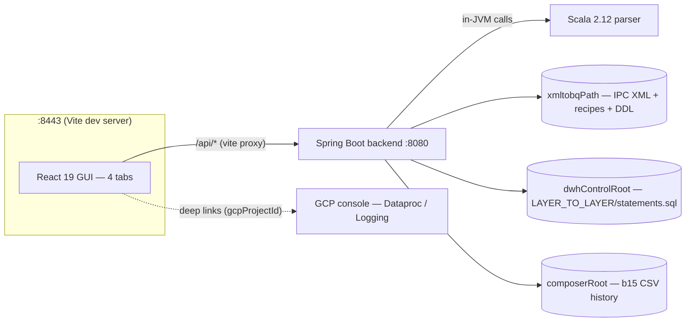
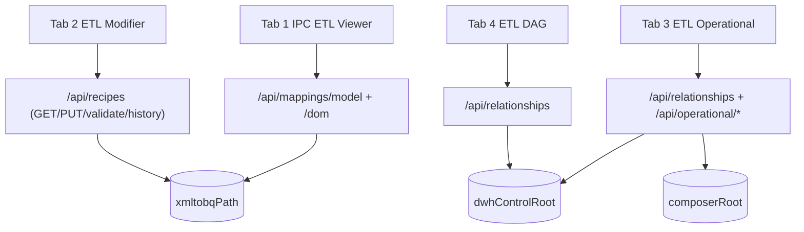
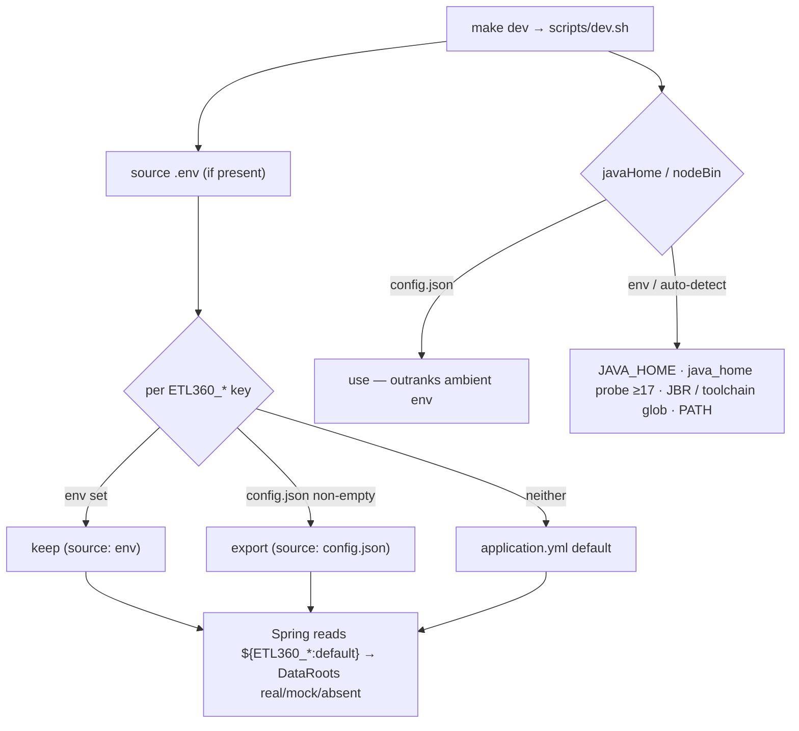
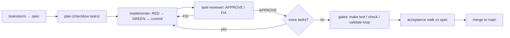

# Distribution, config.json Entrypoint & Reusable SDD/TDD Harness — Implementation Plan (sub-project 6)

> **For agentic workers:** REQUIRED SUB-SKILL: Use superpowers:subagent-driven-development (recommended) or superpowers:executing-plans to implement this plan task-by-task. Steps use checkbox (`- [ ]`) syntax for tracking.

**Goal:** `git pull` → `cp config.example.json config.json` → fill 4 fields → `make dev` runs all four tabs on the user's own data; `config.json` stays optional (fresh clone boots on committed defaults); the SDD/TDD practices become reusable `.claude/` skills + agents + `docs/harness.md`; README HOW-TO + `docs/visual-guide.md` (mermaid + screenshots) document it — per spec `docs/superpowers/specs/2026-07-31-etl360-distribution-design.md` (every section binding).

**Architecture:** The backend already resolves every data root via `${ETL360_*:default}` placeholders (`application.yml:4-14`) with real→mock→absent fallback (`DataRoots.java:29-59`) — so distribution needs NO new Spring config machinery. `scripts/dev.sh` becomes a thin resolver mapping a git-ignored root `config.json` onto those existing env vars (python3-only JSON reads, layering per ADR 0009), plus toolchain resolution that absorbs the current uncommitted local hack. The only backend change is renaming `AppConfigDto.projectId` → `gcpProjectId` so streams B/C's defensive `config?.gcpProjectId ?? 'mock-project'` reads become real.

**Tech Stack:** bash + python3 (stdlib) resolver, Spring Boot MockMvc, `openapi-typescript` regen, mermaid in plain markdown, macOS `screencapture`.

## Global Constraints

- **Environment (every agent session):** frontend tooling `export PATH="$HOME/.local/toolchains/node-v22.23.2-darwin-x64/bin:$PATH"`; backend `export PATH="/usr/local/bin:$PATH"` and `export JAVA_HOME="/Applications/IntelliJ IDEA CE.app/Contents/jbr/Contents/Home"`. (These session exports are exactly what the NEW dev.sh makes obsolete for end users — agent shells still need them because they don't run through dev.sh.)
- **Branch/worktree:** `feat/etl360-distribution` in worktree `.worktrees/etl360-distribution`, forked from current main (`85963a9`): `git worktree add .worktrees/etl360-distribution -b feat/etl360-distribution main`. All paths below are worktree-relative.
- **Gating:** Tasks 1–4 run now. Tasks 5–7 are **[GATED post-merge]: REQUIRE all other streams merged to main + this branch rebased/merged onto that main first — the controller gates this.** Do not start them early.
- **Zero-config invariant:** every task preserves "fresh clone with NO config.json boots on committed defaults".
- **python3 is the ONE JSON mechanism in dev.sh** — never add a `jq` dependency.
- **Verification per task:** backend `mvn -q -am -pl backend test`; frontend (when touched) `cd frontend && pnpm test && npx tsc --noEmit`; shell `bash -n scripts/dev.sh` + a `--check-config` run (bats is not available — this is the shell TDD substitute).
- **Commit protocol:** tick this plan's checkboxes and include this file (`docs/superpowers/plans/2026-07-31-etl360-distribution.md`) in each task's commit; stage explicit paths — NEVER `git add -A` (the MAIN checkout carries an uncommitted USER edit to `scripts/dev.sh` plus untracked `first_prompt.md`/`.claude/settings.json`; the worktree must never sweep strays either).
- **Root-doc ownership:** this stream owns root `CLAUDE.md`/`README.md` edits; parallel streams were told to keep off — but only in the gated tasks.

## Progress & resume protocol

Tick checkboxes per task, commit this file with each task. Resume = `git log --oneline` + first unticked checkbox.

---

### Task 1: config.json schema + dev.sh rewrite + `.gitignore` repair + ADR 0009

**Files:**
- Create: `config.example.json`, `docs/adr/0009-config-json-entrypoint.md`
- Rewrite: `scripts/dev.sh`
- Modify: `.gitignore`

**Interfaces (Tasks 5/7 rely on these):** `scripts/dev.sh --check-config` prints one summary line per key in the form `<name> <value> (<source>[, mode <real|mock|absent>])` and exits 0 without building; env mapping is `xmltobqPath→ETL360_CORPUS_ROOT`, `composerRoot→ETL360_COMPOSER_ROOT`, `dwhControlRoot→ETL360_DWH_CONTROL_ROOT`, `gcpProjectId→ETL360_GCP_PROJECT` (real placeholder names, `application.yml:5,6,8,10`), `javaHome→JAVA_HOME`, `nodeBin→PATH` prepend.

- [x] **Step 1: `config.example.json`** (defaults = committed mock/sample data; empty string = auto-detect):

```json
{
  "xmltobqPath": "parser/src/main/resources/xmltobq",
  "composerRoot": "backend/src/main/resources/mock/composer",
  "dwhControlRoot": "backend/src/main/resources/mock/DWH_CONTROL",
  "gcpProjectId": "my-gcp-project",
  "javaHome": "",
  "nodeBin": ""
}
```

- [x] **Step 2: `.gitignore`** — append `/config.json` and `/.env`, AND repair the `85963a9` breakage: the current last line `parser/src/main/scala/io/pure360/ipc/xmltojson/doc.worktrees/` is a no-newline concatenation (verify: `git show 85963a9 -- .gitignore` shows `\ No newline at end of file` on the removed side; `git check-ignore .worktrees` currently matches nothing). Split it back into two lines with a trailing newline:

```
parser/src/main/resources/DWH_CONTROL
parser/src/main/scala/io/pure360/ipc/xmltojson/doc
.worktrees/

/config.json
/.env
```

- [x] **Step 3: rewrite `scripts/dev.sh`** (full content — replaces today's 14 lines; the uncommitted USER edit adding JAVA_HOME/toolchain exports becomes obsolete):

```bash
#!/usr/bin/env bash
# ETL 360 dev boot: resolve config (config.json / .env / environment / auto-detect),
# build backend, boot backend + frontend. `--check-config` prints the resolution
# table and exits. Layering: ADR-0009. HOW-TO: README "Run the 360 suite on your own data".
set -euo pipefail
cd "$(dirname "$0")/.."

# ANSI only on a TTY with NO_COLOR unset (https://no-color.org)
if [ -t 1 ] && [ -z "${NO_COLOR:-}" ]; then
  BLD=$'\033[1m'; DIM=$'\033[2m'; GRN=$'\033[32m'; CYN=$'\033[36m'; RST=$'\033[0m'
else BLD=''; DIM=''; GRN=''; CYN=''; RST=''; fi
step() { echo "${BLD}${CYN}[$1]${RST} $2"; }

step 1/4 "config resolution"
# .env tier: sourced with allexport so its values count as environment below.
if [ -f .env ]; then set -a; . ./.env; set +a; fi
# config.json: validated once, read via python3 (stdlib) — jq is NOT assumed.
if [ -f config.json ] && ! python3 -m json.tool config.json >/dev/null 2>&1; then
  echo "config.json is not valid JSON — fix it or remove it"; exit 1
fi
cfg() {  # cfg <key> -> string value or empty
  [ -f config.json ] || return 0
  python3 -c 'import json,sys
v = json.load(open("config.json")).get(sys.argv[1], "")
print(v if isinstance(v, str) else "", end="")' "$1"
}
# NOTE: resolve() must be called directly (never via $(...)) — a command-substitution
# subshell would swallow the exports.
resolve() {  # resolve <ENV_VAR> <jsonKey>; env > config.json > default; sets RES_SRC
  local var="$1" v
  if [ -n "${!var:-}" ]; then RES_SRC="env"; return; fi
  v="$(cfg "$2")"
  if [ -n "$v" ]; then export "$var=$v"; RES_SRC="config.json"; return; fi
  RES_SRC="default"
}
resolve ETL360_CORPUS_ROOT xmltobqPath;         SRC_CORPUS=$RES_SRC
resolve ETL360_COMPOSER_ROOT composerRoot;      SRC_COMPOSER=$RES_SRC
resolve ETL360_DWH_CONTROL_ROOT dwhControlRoot; SRC_DWH=$RES_SRC
resolve ETL360_GCP_PROJECT gcpProjectId;        SRC_GCP=$RES_SRC

# Toolchains: config.json OUTRANKS ambient env (machine-global JAVA_HOME/PATH are the
# usual noise — on this repo's dev machine `java_home -v 17` returns an Azul 11).
jmajor() { "$1/bin/java" -version 2>&1 | sed -nE 's/.*version "([0-9]+).*/\1/p' | head -1; }
JBR="/Applications/IntelliJ IDEA CE.app/Contents/jbr/Contents/Home"
v="$(cfg javaHome)"
if [ -n "$v" ]; then export JAVA_HOME="$v"; SRC_JAVA="config.json"
elif [ -n "${JAVA_HOME:-}" ]; then SRC_JAVA="env"
elif v="$(/usr/libexec/java_home -v 17 2>/dev/null)" && [ "$(jmajor "$v")" -ge 17 ] 2>/dev/null; then
  export JAVA_HOME="$v"; SRC_JAVA="auto (java_home)"
elif [ -d "$JBR" ] && [ "$(jmajor "$JBR")" -ge 17 ] 2>/dev/null; then
  export JAVA_HOME="$JBR"; SRC_JAVA="auto (IntelliJ JBR)"
else SRC_JAVA="unset — PATH java"; fi
if [ -n "${JAVA_HOME:-}" ] && [ "$(jmajor "$JAVA_HOME")" -lt 17 ] 2>/dev/null; then
  echo "warning: JAVA_HOME is JDK $(jmajor "$JAVA_HOME") — backend needs 17+ (set javaHome in config.json)"
fi
v="$(cfg nodeBin)"
if [ -n "$v" ]; then export PATH="$v:$PATH"; SRC_NODE="config.json"
elif v="$(ls -d "$HOME"/.local/toolchains/node-v*/bin 2>/dev/null | sort -V | tail -1)" && [ -n "$v" ]; then
  export PATH="$v:$PATH"; SRC_NODE="auto (toolchain)"
elif command -v node >/dev/null; then SRC_NODE="PATH"
else SRC_NODE="missing"; fi

# Effective values (defaults mirror backend/src/main/resources/application.yml) + modes
CORPUS="${ETL360_CORPUS_ROOT:-parser/src/main/resources/xmltobq}"
DWH="${ETL360_DWH_CONTROL_ROOT:-parser/src/main/resources/DWH_CONTROL}"
COMPOSER="${ETL360_COMPOSER_ROOT:-parser/src/main/resources/composer}"
GCP="${ETL360_GCP_PROJECT:-db-dev-example-project}"
mode() { if [ -d "$1" ]; then echo real; elif [ -d "backend/src/main/resources/mock/$2" ]; then echo mock; else echo absent; fi; }
row() { printf '  %-12s %s %s(%s)%s\n' "$1" "$2" "$DIM" "$3" "$RST"; }
row xmltobq     "$CORPUS"   "$SRC_CORPUS"
row DWH_CONTROL "$DWH"      "$SRC_DWH, mode $(mode "$DWH" DWH_CONTROL)"
row composer    "$COMPOSER" "$SRC_COMPOSER, mode $(mode "$COMPOSER" composer)"
row gcp-project "$GCP"      "$SRC_GCP"
row JAVA_HOME   "${JAVA_HOME:-—}" "$SRC_JAVA"
row node        "$(command -v node || echo '—')" "$SRC_NODE"

if [ "${1:-}" = "--check-config" ]; then exit 0; fi
command -v mvn  >/dev/null || { echo "mvn not found — install Maven 3.9+"; exit 1; }
command -v node >/dev/null || { echo "node not found — set nodeBin in config.json or install Node 22"; exit 1; }
command -v pnpm >/dev/null || { echo "pnpm not found — corepack enable, or install pnpm 9+"; exit 1; }
trap 'kill 0 2>/dev/null' INT TERM EXIT

step 2/4 "backend build"
# `mvn -am -pl backend spring-boot:run` fans the run goal across the reactor
# (including parser) and fails — install parser+backend, then run scoped to backend.
mvn -q -am -pl backend install -DskipTests

step 3/4 "backend boot"
( cd backend && mvn -q spring-boot:run 2>&1 | sed -u 's/^/[backend]  /' ) &
printf '  waiting for http://127.0.0.1:8080/api/health '
for i in $(seq 1 90); do
  if curl -sf localhost:8080/api/health >/dev/null; then echo " ${GRN}up${RST}"; break; fi
  printf '.'; sleep 1
  if [ "$i" = 90 ]; then echo " backend never came up (see [backend] log)"; exit 1; fi
done

step 4/4 "frontend"
( cd frontend && pnpm dev 2>&1 | sed -u 's/^/[frontend] /' ) &
echo "${BLD}ETL 360 up${RST} — backend ${GRN}http://127.0.0.1:8080${RST} · frontend ${GRN}http://localhost:8443${RST} (proxies /api/*) · Ctrl-C stops both"
wait
```

- [x] **Step 4: ADR** `docs/adr/0009-config-json-entrypoint.md` (template `docs/adr/0000-template.md`, ≤30 lines):

```markdown
# ADR-0009: config.json entrypoint with env-var layering

**Status:** Accepted

## Context

Running the suite on own data required hand-exporting four ETL360_* vars plus
JAVA_HOME/node paths; scripts/dev.sh accrued uncommitted local toolchain hacks. The
backend already resolves every root via `${ETL360_*:default}` placeholders
(application.yml) with real→mock→absent fallback (DataRoots), so a thin optional
front door can feed it without new Spring code.

## Decision

A git-ignored root `config.json` (committed `config.example.json` template) is the
single user entrypoint: xmltobqPath, composerRoot, dwhControlRoot, gcpProjectId,
javaHome, nodeBin. `scripts/dev.sh` maps it onto the existing env vars. Layering for
ETL360_* keys: application.yml defaults < config.json < .env < shell env; for
javaHome/nodeBin, config.json outranks ambient env (machine-global toolchain vars
are noise; repo-specific ETL360_* vars are deliberate). Empty string = auto-detect.
config.json is optional — a fresh clone boots on committed defaults.

## Consequences

- `git pull && cp config.example.json config.json && make dev` runs on own data.
- Backend stays mechanism-agnostic; env vars remain the only backend contract.
- The dev.sh mapping table must track application.yml by hand (acceptance-walked).

## Alternatives considered

- **`spring.config.import` of config.json** — couples the backend to a suite-level
  concern; dev.sh would still need its own reader for toolchains.
- **`.env` as sole entrypoint** — users must learn ETL360_* names instead of four
  domain keys; no place for javaHome/nodeBin semantics.
```

- [x] **Step 5: verify** — `bash -n scripts/dev.sh`; `bash scripts/dev.sh --check-config` (expect all sources `env` in an agent shell / `default` in a clean one); `cp config.example.json config.json && env -u ETL360_CORPUS_ROOT -u JAVA_HOME NO_COLOR=1 bash scripts/dev.sh --check-config` (expect `config.json` sources, no ANSI bytes: pipe through `grep -c $'\033'` → 0); `rm config.json`. Then a full `make dev` boot smoke: health `up`, Ctrl-C teardown clean.
- [x] **Step 6: Commit**

```bash
git add config.example.json scripts/dev.sh .gitignore docs/adr/0009-config-json-entrypoint.md docs/superpowers/plans/2026-07-31-etl360-distribution.md
git commit -m "feat(dist): config.json entrypoint + dev.sh resolver with staged boot logging (ADR-0009)"
```

---

### Task 2: backend `gcpProjectId` — DTO rename, integration test, types regen

**Files:**
- Modify: `backend/src/main/java/io/pure360/etl360/api/dto/AppConfigDto.java` (field `projectId` → `gcpProjectId` + javadoc line)
- Modify: `backend/src/test/java/io/pure360/etl360/api/ConfigControllerTest.java` (`EXPECTED_FIELDS`)
- Create: `backend/src/test/java/io/pure360/etl360/api/ConfigGcpProjectOverrideTest.java`
- Regenerate: `frontend/src/api/types.gen.ts` (via `make generate-api` — never hand-edited, `frontend/AGENTS.md` convention)

**Interfaces:** `/api/config` responds `{ gcpProjectId, region, dataprocJobUrl, dataprocClusterUrl, loggingUrl, dwhControlMode, composerMode, corpusRoot }` — still exactly 8 fields. `ConfigController.java` needs NO edit (positional record construction, `ConfigController.java:22-30`). Frontend `AppConfig` type gains `gcpProjectId` via regen; streams B/C's `config?.gcpProjectId ?? 'mock-project'` becomes real at merge.

- [x] **Step 1: RED.** In `ConfigControllerTest.java:29-31` replace `"projectId"` with `"gcpProjectId"` in `EXPECTED_FIELDS`; add the new test class:

```java
package io.pure360.etl360.api;

import org.junit.jupiter.api.Test;
import org.springframework.beans.factory.annotation.Autowired;
import org.springframework.boot.test.autoconfigure.web.servlet.AutoConfigureMockMvc;
import org.springframework.boot.test.context.SpringBootTest;
import org.springframework.test.web.servlet.MockMvc;

import static org.springframework.test.web.servlet.request.MockMvcRequestBuilders.get;
import static org.springframework.test.web.servlet.result.MockMvcResultMatchers.*;

/** The config.json→ETL360_GCP_PROJECT→property thread: application.yml binds the env
 * var via ${ETL360_GCP_PROJECT:...} (application.yml:10); this proves property→response. */
@SpringBootTest(properties = "etl360.gcp.project-id=cfg-itest-project")
@AutoConfigureMockMvc
class ConfigGcpProjectOverrideTest {
    @Autowired MockMvc mvc;

    @Test
    void servesTheConfiguredGcpProjectId() throws Exception {
        mvc.perform(get("/api/config"))
            .andExpect(status().isOk())
            .andExpect(jsonPath("$.gcpProjectId").value("cfg-itest-project"));
    }
}
```

Run `mvn -q -am -pl backend test` — expect BOTH config tests failing (field still `projectId`). Capture output.
- [x] **Step 2: GREEN.** `AppConfigDto.java:9`: rename the record component `projectId` → `gcpProjectId`; update the javadoc's field mention. Re-run `mvn -q -am -pl backend test` — all green.
- [x] **Step 3: regen types.** Boot the backend (`mvn -q -am -pl backend install -DskipTests`, then `cd backend && mvn -q spring-boot:run` in background; wait on `/api/health`), run `make generate-api`, kill the backend (verify port 8080 free). `git diff frontend/src/api/types.gen.ts` must show only `projectId` → `gcpProjectId` in the `AppConfigDto` schema.
- [x] **Step 4:** `cd frontend && pnpm test && npx tsc --noEmit` — clean (zero `projectId` consumers on main, grep-verified; re-grep after the parallel-stream rebase in Task 5's gate).
- [x] **Step 5: Commit**

```bash
git add backend/src/main/java/io/pure360/etl360/api/dto/AppConfigDto.java backend/src/test/java/io/pure360/etl360/api/ConfigControllerTest.java backend/src/test/java/io/pure360/etl360/api/ConfigGcpProjectOverrideTest.java frontend/src/api/types.gen.ts docs/superpowers/plans/2026-07-31-etl360-distribution.md
git commit -m "feat(config): /api/config projectId -> gcpProjectId — property-to-frontend thread real"
```

---

### Task 3: harness skills (`sdd-cycle`, `tab-rewire`) + agents (`implementer`, `task-reviewer`) + `docs/harness.md`

**Files:**
- Create: `.claude/skills/sdd-cycle/SKILL.md`, `.claude/skills/tab-rewire/SKILL.md`
- Create: `.claude/agents/implementer.md`, `.claude/agents/task-reviewer.md`
- Create: `docs/harness.md`

Conventions: superpowers:writing-skills (frontmatter `name` + third-person "Use when…" `description`, ≤1024 chars, no workflow summary in the description). `mock-etl-data` is Stream B's — referenced in harness.md, NOT duplicated. `.claude/skills/{regen-corpus,run-app,validate-loop}` already committed — untouched.

- [x] **Step 1: `.claude/skills/sdd-cycle/SKILL.md`:**

```markdown
---
name: sdd-cycle
description: Use when starting, resuming, or reviewing an ETL 360 sub-project — from brainstorm to merged branch, including where specs/plans live, the per-task loop, the checkbox/commit ledger, and the gates.
---

# sdd-cycle — how this repo ships a sub-project

## Outer loop

1. **Brainstorm → spec** (superpowers:brainstorming): write
   `docs/superpowers/specs/YYYY-MM-DD-<name>-design.md` — numbered sections, ground
   truth cited as `file:line`, explicit non-goals, acceptance criteria. User approves.
2. **Plan** (superpowers:writing-plans): `docs/superpowers/plans/YYYY-MM-DD-<name>.md`
   — header, Global Constraints, per-task Files/Interfaces/checkbox steps with REAL
   code, exact commit messages, explicit staged paths. No placeholders.
3. **Branch**: worktree `.worktrees/<name>`, branch `feat/etl360-<name>`
   (superpowers:using-git-worktrees). Parallel streams fork from main AFTER shared
   foundations merge; root CLAUDE.md/README edits are single-owner and go LAST.
4. **Per task**: dispatch the `implementer` agent with the FULL task brief, then
   `task-reviewer`; fix-loop until APPROVE
   (superpowers:subagent-driven-development).
5. **Gates**: `make test` → `make check` → `make validate-loop` (docs/harness.md
   explains what each proves). New sweeps get wired INTO validate-loop, not beside it.
6. **Acceptance walk**: the final task re-verifies every spec criterion, PASS/FAIL
   with evidence (superpowers:verification-before-completion).
7. **Merge** (superpowers:finishing-a-development-branch).

## Inner loop (every implementation task)

RED (failing test, output captured) → GREEN (minimal implementation) → verify
(frontend `cd frontend && pnpm test && npx tsc --noEmit`; backend
`mvn -q -am -pl backend test`) → commit. Task ordering across a plan layers:
functional prerequisites (data/fixtures/corpus) → backend/middleware → GUI →
gates/docs — never GUI before its data contract exists.

## Ledger & commit protocol

- Tick the plan's `- [ ]` checkboxes and stage the plan file IN the task's commit —
  commit history is the resumability record; resume = first unticked checkbox.
- Stage explicit paths only. NEVER `git add -A` (user-local untracked files exist).

## Model tiering

Spec, plan, and review deserve the strongest available model; mechanical tasks
(fixture capture, key renames, formatting) may run a cheaper tier — the brief carries
the design, not the model. Never tier the task-reviewer below the implementer.
```

- [x] **Step 2: `.claude/skills/tab-rewire/SKILL.md`:**

```markdown
---
name: tab-rewire
description: Use when converting a mock-fed ETL 360 frontend tab to real backend data, or adding a corpus-wide render gate for one — the adapter-first recipe proven on Tabs 1 and 2.
---

# tab-rewire — taking a mock tab real

1. **Adapter first.** Pure module `frontend/src/api/<x>Adapter.ts` mapping the DTO
   onto the EXISTING view types (`frontend/src/types.ts`) — `import type` only,
   relative runtime imports with explicit `.ts` extensions so
   `node --experimental-strip-types` can load it for sweeps. Never invent parallel types.
2. **Fixtures from the corpus.** Boot the backend, `curl` real payloads into
   `frontend/src/api/__fixtures__/*.json` (anonymized/SYN corpus data is committable).
3. **TDD the adapter** on fixtures: kinds, ports, edges (no dangling), finite layout,
   unknown-type 3-letter fallback, empty/unparseable input → empty output, never throw.
4. **Rewire the component:** swap the mock import for hooks + adapter; add
   loading/error/empty states from EXISTING tokens only. RTL+MSW proof: click a tree
   file → the real card renders.
5. **Sweep gate.** `scripts/<x>_sweep.mts` walks `/api/tree`, runs every corpus file
   through the adapter, asserts the floor (69 mappings / 74 recipes / 18 L2L); wire
   it into `scripts/validate_loop.sh`. A FAIL names the file: fix the adapter, never
   skip corpus entries.
6. **Retire the mock:** grep proves no other importer, delete the export, update the
   `mockData.ts` header ledger + `frontend/AGENTS.md`.

## Hard rules

- Figma visual contract (`docs/adr/0005`): data-source swap only; any sanctioned
  visual change must be listed in the spec BEFORE implementation.
- Dot-notation refs (`"TABLE.FIELD"`) are preserved verbatim — never normalize.
- New multi-render test files add `afterEach(() => cleanup())` — no global RTL cleanup here.
```

- [x] **Step 3: `.claude/agents/implementer.md`:**

```markdown
---
name: implementer
description: Executes exactly one task from a docs/superpowers plan with TDD evidence. Give it the full task brief text, the plan path, and the worktree — never a summary.
tools: Bash, Read, Edit, Write, Grep, Glob
---

You implement EXACTLY ONE task from an ETL 360 implementation plan, in the worktree
named in your brief. Read `.claude/skills/sdd-cycle/SKILL.md` first.

Rules:
- TDD: write/adjust the failing test FIRST, run it, capture RED output verbatim;
  implement minimally; capture GREEN. Both go in your report.
- Follow the brief's Files/Interfaces/steps exactly. Any deviation gets a numbered
  "Deviation:" entry with rationale — never silent.
- Verify before claiming done: `cd frontend && pnpm test && npx tsc --noEmit` and/or
  `mvn -q -am -pl backend test` for whichever side you touched.
- Commit with the plan's EXACT message; stage explicit paths plus the plan file with
  its checkboxes ticked. NEVER `git add -A`.

Report contract (final message): task name · changed-file list · RED evidence ·
GREEN evidence · verification tail · deviations (or "none") · commit hash.
```

- [x] **Step 4: `.claude/agents/task-reviewer.md`:**

```markdown
---
name: task-reviewer
description: Reviews one implemented plan task against its brief and the repo's hard rules. Run after every implementer report, before the next task starts. Read-only.
tools: Bash, Read, Grep, Glob
---

You review the latest task's commit(s) against the task brief you are given. You
never edit files. Check, citing `file:line` evidence:

1. **Fidelity** — every step done as written; deviations declared and justified.
2. **TDD honesty** — the diff shows test-first (test exercises the new behavior, not
   the implementation's internals); no test deleted or weakened to pass.
3. **Hard rules** — Figma visual contract (data swap only), dot-ref verbatim
   preservation, `git show --stat` free of stray/swept files, plan checkboxes ticked
   and the plan file present in the commit.
4. **Quality** — dead code, duplication vs existing helpers, IO error handling.

Output format:
- **Verdict:** APPROVE | FIX (any blocking finding = FIX)
- **Blocking:** numbered, each with file:line + why + suggested fix
- **Non-blocking:** advisory notes
- **Evidence checked:** the commands you ran
```

- [x] **Step 5: `docs/harness.md`** — sections (write in full, ~70 lines): **Skills** table (`regen-corpus`, `run-app`, `validate-loop`, `mock-etl-data` [authored by Stream B — safe CAS/SYN mock-data regeneration], `sdd-cycle`, `tab-rewire` — one "use when" line each, pointing at `.claude/skills/<name>/SKILL.md`); **Subagents** (`implementer`, `task-reviewer` — brief contract, report/verdict formats, the fix-loop); **Loop layering** (functional prerequisites → data/mock layer → backend/middleware → GUI → gates, with sub-projects 1–5 as worked examples: foundation → synthetic data → viewer → modifier/casuistics); **How the gates compose** (`make test` = backend reactor + vitest; `make check` = + `tsc --noEmit` + format check; `make validate-loop` = booted-backend endpoint loop + viewer/recipe sweeps + frontend hook tests — cite `scripts/validate_loop.sh`); **Starting a new sub-project** (checklist: brainstorm → spec → plan → worktree → sdd-cycle per task → acceptance → merge; root-doc edits last, single owner). Cross-link `docs/visual-guide.md` for the harness-loop diagram — do not duplicate the diagram here (DRY).
- [x] **Step 6: verify** — frontmatter of both skills ≤1024-char descriptions, "Use when" phrasing; `python3 - <<'PY'` YAML-frontmatter sanity optional; no repo tests affected: `git status` shows only the five new files.
- [x] **Step 7: Commit**

```bash
git add .claude/skills/sdd-cycle/SKILL.md .claude/skills/tab-rewire/SKILL.md .claude/agents/implementer.md .claude/agents/task-reviewer.md docs/harness.md docs/superpowers/plans/2026-07-31-etl360-distribution.md
git commit -m "feat(harness): sdd-cycle + tab-rewire skills, implementer/task-reviewer agents, docs/harness.md"
```

**Review fix (task-reviewer FIX, addressed same task):** `docs/harness.md`'s
freely-authored sub-projects list had three factual misattributions —
`mock-etl-data`'s author paraphrased as "the synthetic-data stream" instead of the
brief's literal "Stream B" (which is the operational-casuistics sub-project, not
synthetic-operational-data); the composer mock tier (ADR-0003, commit `5081f14`)
credited to ETL Modifier instead of Synthetic operational data, where it actually
landed; and Operational casuistics described as having "no new UI surface" though
its own spec §6 rewires Tab 3. Also added a caveat that the sub-projects 1–5
numbering reflects shipped order, not each spec's self-declared ordinal (two specs
independently call themselves "sub-project 4"). Fixed in commit `fix(harness):
correct mock-etl-data and composer-tier attributions in harness.md`.

---

### Task 4: `docs/visual-guide.md` — mermaid diagrams + screenshot scaffold

**Files:**
- Create: `docs/visual-guide.md` (image links included now; `.png` files land in gated Task 6 on this same branch before merge — stated in the doc's Screenshots intro)

- [x] **Step 1: write the doc.** Structure: intro (what/why, DRY note: README links here; harness.md links §4) + four mermaid diagrams + Screenshots section. Diagrams (real content):

**§1 Suite architecture**


**§2 Data flow per tab**


**§3 config.json resolution (per ADR-0009)**


**§4 SDD/TDD harness loop**


**Screenshots section** — one `## Screenshot` block per capture with `` + a one-line caption: `tab1-viewer.png` (Tab 1, `CDM/m_DM_INFOHUB_BIZLINK` rendered), `tab2-modifier.png` (recipe canvas + palette), `tab3-operational.png`, `tab4-dag.png`, `sidebar-collapsed.png` (slim Explorer rail), `modifier-editing.png` (SaveBar counting + formula editing), `operational-preview-overlay.png`. Intro line states images are captured from the running merged app (Task 6) at Chrome ~1440×900.
- [x] **Step 2: verify** — mermaid blocks render (paste-check in a mermaid-aware previewer, or `npx -y @mermaid-js/mermaid-cli -i` if network permits; else visual inspection of syntax), all 7 image links match the Task 6 capture list exactly.
- [x] **Step 3: Commit**

```bash
git add docs/visual-guide.md docs/superpowers/plans/2026-07-31-etl360-distribution.md
git commit -m "docs(visual): visual-guide — architecture, tab data-flow, config resolution, harness loop diagrams"
```

---

### Task 5 [GATED post-merge]: README HOW-TO + CLAUDE.md practices + .env.example

**GATE: REQUIRES all other streams merged to main + this branch rebased/merged onto that main first — controller gates this.** After the rebase: re-run `make test`; re-grep `projectId` across `frontend/src` (streams B/C must read `gcpProjectId`; fix any straggler here).

**Files:**
- Modify: `README.md` (new section after "Configuration"), `CLAUDE.md`, `.env.example`

- [x] **Step 1: README "Run the 360 suite on your own data".** Content (verbatim skeleton):

````markdown
## Run the 360 suite on your own data

```bash
git pull
cp config.example.json config.json   # git-ignored — yours to edit
$EDITOR config.json                  # point the 4 data fields at your exports
make dev                             # resolved config echoes at [1/4]; --check-config to dry-run
```

`config.json` is **optional** — with no file at all, `make dev` boots on the committed
sample corpus and mock operational tiers. Field reference (empty string = auto-detect;
layering in `docs/adr/0009-config-json-entrypoint.md`):

| Field | Feeds | Expected layout |
|---|---|---|
| `xmltobqPath` | `ETL360_CORPUS_ROOT` | IPC XML corpus, see tree below |
| `composerRoot` | `ETL360_COMPOSER_ROOT` | b15 CSV history, see tree below |
| `dwhControlRoot` | `ETL360_DWH_CONTROL_ROOT` | `LAYER_TO_LAYER/` statements, see below |
| `gcpProjectId` | `ETL360_GCP_PROJECT` | project id for Dataproc/Logging deep links |
| `javaHome` | `JAVA_HOME` | JDK 17+ home (e.g. an IDE-bundled JBR) |
| `nodeBin` | `PATH` | a Node ≥ 22.6 `bin/` directory |

Expected layouts (layers: `STG ODS DWH CDM RDM QDM ETL OUTPUT`):

```
<xmltobqPath>/<LAYER>/m_NAME.xml          # IPC Powermart export
<xmltobqPath>/<LAYER>/m_NAME/             # parser output, next to the XML
    _ETL_m_NAME.json                      #   recipe
    <TABLE>.json                          #   BigQuery DDL per table

<composerRoot>/dwh/config/cluster_tuning/inputs/<YYYY_MM_DD>/
    b15_application_end_with_recipe_null_status.csv
    # columns: cluster_name,recipe_filename,job_id,app_start_iso,
    #          avg_job_duration_in_mins_sec,status,message

<dwhControlRoot>/LAYER_TO_LAYER/<LAYER>/statements.sql
    # rows: INSERT INTO CONTROL.SCALAMATICA_LAYER_TO_LAYER_CONFIG VALUES
    #   ('DWH','src/...','_ETL_m_X.json','wf_X','TARGET_TABLE',3,
    #    [STRUCT('SRC_TABLE', true, 0)], ['LKP_X'],
    #    [STRUCT('TARGET_TABLE','TRUNCATE_INSERT')],
    #    [STRUCT('TARGET_TABLE','DAILY','LOAD_DATE','UNKNOWN_SUBPARTITION')])
```

Note: pointing `composerRoot`/`dwhControlRoot` at the committed mock dirs serves the
same data but reports mode `real` in `/api/config` — an explicitly configured
directory wins the real tier. Diagrams (architecture, per-tab data flow, config
resolution): `docs/visual-guide.md` — screenshots of every tab live there too.
````

Also in README: update the `scripts/dev.sh` paragraph (install-then-run text stays; add the `[1/4]`…`[4/4]` staged boot + `--check-config` mention) and note the committed script now resolves toolchains itself — **any local `JAVA_HOME`/PATH edits inside `scripts/dev.sh` are obsolete; discard them** (`git checkout -- scripts/dev.sh` in the old main checkout).
- [x] **Step 2: CLAUDE.md.** (a) Build & run bullet: "`config.json` (git-ignored, `config.example.json` template) is the user entrypoint — `scripts/dev.sh` maps it onto `ETL360_*` env vars and resolves JAVA_HOME/node; `scripts/dev.sh --check-config` dry-runs the resolution (ADR-0009)." (b) New short section before "More":

```markdown
## Working practices

Sub-projects run the SDD/TDD harness: spec → plan → per-task TDD with the
`implementer`/`task-reviewer` agents → gates → acceptance walk. The loop, the
common skills (`sdd-cycle`, `tab-rewire`, `mock-etl-data`, `regen-corpus`,
`run-app`, `validate-loop`), and how the gates compose: `docs/harness.md`.
Visual overview + screenshots: `docs/visual-guide.md`.
```

(c) "More" list gains `docs/harness.md` + `docs/visual-guide.md`.
- [x] **Step 3: `.env.example`.** Fix the stale composer comment (lines 21-22 — composer HAS a mock tier, `DataRoots.java:45-51`: mode is `real | mock | absent`); add a header note: ".env is the power-user tier — layering is defaults < config.json < .env < shell env for ETL360_* (ADR-0009); most users want config.json instead."
- [x] **Step 4: verify** — `make test` green post-rebase; README renders (link check to visual-guide/ADR paths exist).
- [x] **Step 5: Commit**

```bash
git add README.md CLAUDE.md .env.example docs/superpowers/plans/2026-07-31-etl360-distribution.md
git commit -m "docs(dist): README run-on-your-own-data HOW-TO, CLAUDE.md practices, .env layering"
```

---

### Task 6 [GATED post-merge]: screenshots — capture + embed

**GATE: same as Task 5 (screenshots must show the merged, real tabs). Gate satisfied
— this branch is post-merge (8c62ae3) with Task 5 landed (d6b347d).**

**Outcome: capture was not possible in this session's environment — this is the
documented fallback path, not a blocker.** Checked for browser automation before
touching anything: no `claude-in-chrome`-style MCP tool registered (`ToolSearch`
found none), no Playwright/Puppeteer in `frontend/package.json`, `node_modules`, or
on `PATH`. macOS `screencapture` exists but requires a Chrome window already showing
the target UI state, which needs GUI interaction (navigate tabs, select a mapping,
open an overlay) this agent has no tool to perform — so rather than fake a capture or
leave the 7 dangling `docs/img/*.png` links silent, `docs/visual-guide.md`'s
Screenshots section was rewritten as an honest, numbered ~5-minute human capture
checklist (exact state + exact filename + the `screencapture -x -o` one-liner per
shot), with the `![...]` links left in place so dropping same-named PNGs into
`docs/img/` later needs no further doc edits. Nothing was installed.

**Files:**
- Create: `docs/img/.gitkeep` (the 7 `.png` files remain uncaptured — see above)
- Modify: `docs/visual-guide.md` — Screenshots section rewritten as a capture checklist

- [x] **Step 1: environment check.** No GUI automation available (see Outcome above) — capture is not possible this session; proceeding on the documented fallback instead of the original boot/capture steps.
- [x] **Step 2: honest checklist instead of capture.** Converted the 7 screenshot entries into a numbered capture checklist (tab, exact UI state, filename, `screencapture` hint) in `docs/visual-guide.md`; image links kept in place for a drop-in later.
- [x] **Step 3: verify** — `docs/img/.gitkeep` created so the directory exists and is trackable; `ls docs/img` shows no stray files; markdown link/anchor check finds no other doc referencing the old per-shot headings (none did). No suite was booted (nothing to tear down).
- [x] **Step 4: Commit**

```bash
git add docs/img/.gitkeep docs/visual-guide.md docs/superpowers/plans/2026-07-31-etl360-distribution.md
git commit -m "docs(visual): screenshot capture checklist — PNGs pending human capture"
```

---

### Task 7 [GATED post-merge]: acceptance walk

Walk spec §12, recording PASS/FAIL with evidence per criterion:

- [x] **Step 1: fresh-clone simulation.** `mv config.json config.json.local 2>/dev/null || true`; in a clean env (`env -u ETL360_CORPUS_ROOT -u ETL360_COMPOSER_ROOT -u ETL360_DWH_CONTROL_ROOT -u ETL360_GCP_PROJECT`): `bash scripts/dev.sh --check-config` → every source `default`/`auto`/`env-free`; then `make dev` boots; `curl -s localhost:8080/api/health` → `UP`, `curl -s localhost:8080/api/operational/dates` includes `2026-07-29`; modes `mock` for DWH_CONTROL/composer (caveat: a stale git-ignored real `parser/src/main/resources/DWH_CONTROL` locally wins the real tier — README-documented, record if hit). Save `/api/operational/2026-07-29` output. Tear down. **PASS** — no config.json/.env/stale real dirs present; every source `default`/`auto`; health UP, xmlCount 81/recipeCount 86, both modes `mock` (caveat not hit); all four tabs' endpoints 200; ports confirmed free after teardown. Evidence: `task-7-report.md` §1.
- [x] **Step 2: explicit-config parity.** `cp config.example.json config.json`; `--check-config` shows the four data keys sourced `config.json` and matching the example values (the resolution table IS the contract — diff eyeball); boot; `/api/operational/2026-07-29` byte-identical to Step 1's capture; **expected label flip**: `dwhControlMode`/`composerMode` now `real` (`DataRoots.java:37-43,53-58` — explicitly configured dirs exist) — record as expected, data identical. `curl -s localhost:8080/api/config` serves `"gcpProjectId":"my-gcp-project"`. **PASS** — all four keys sourced `config.json` matching the example; mode flip to `real` confirmed expected; `diff` of the two `/api/operational/2026-07-29` captures produced zero output (byte-identical); `gcpProjectId":"my-gcp-project"` confirmed; config.json removed after, not committed. Evidence: `task-7-report.md` §2.
- [x] **Step 3: hygiene.** `bash -n scripts/dev.sh`; `NO_COLOR=1 bash scripts/dev.sh --check-config | grep -c $'\033'` → 0; `git check-ignore config.json .env .worktrees` all match now. **PASS** — `bash -n` clean; ANSI grep count 0; `git check-ignore -v config.json .env .worktrees/` all three match (the `/` on `.worktrees/` is required by git's directory-pattern semantics, not a bug). Evidence: `task-7-report.md` §4.
- [x] **Step 4: gates.** `make test`, `make check`, `make validate-loop` — all green. **PASS** — backend 90/90, frontend 150/150 (`make test`); `tsc --noEmit` clean, format-check backlog non-fatal by design (`make check`); `[validate-loop] PASS` with all sweeps green including relationships_sweep's 12 casuistics (`make validate-loop`). Evidence: `task-7-report.md` §6.
- [x] **Step 5: docs criteria.** README HOW-TO present with the three layout blocks; `docs/visual-guide.md` renders with 7 existing images; `docs/harness.md` + both skills + both agents present; ADR 0009 filed; CLAUDE.md practices section links harness.md; `.env.example` composer text corrected. **PASS**, with one **DEFERRED-human** sub-item: all docs/skills/agents/ADR present and correct; `docs/visual-guide.md`'s 4 mermaid diagrams render; but the 7 screenshot PNGs do NOT exist (Task 6's documented no-browser-automation fallback) — `docs/img/` holds only `.gitkeep`, and the Screenshots section is an honest human capture checklist instead. Recorded as deferred, not silently passed. Evidence: `task-7-report.md` §5.
- [x] **Step 6: restore** the user's `config.json.local` if it existed; then commit the record: no `config.json.local` existed at walk start (nothing to restore); `config.json`/`.env` absent at walk end; ports free; working tree clean aside from this plan + the report.

```bash
git add docs/superpowers/plans/2026-07-31-etl360-distribution.md
git commit --allow-empty -m "chore: distribution acceptance walk — zero-config boot, explicit-config parity, docs verified"
```

---

### Task 8: final-review fixes — honest screenshot status, `.env` precedence, literal dry-run, stale comment

Pre-merge review of the acceptance-walked branch surfaced four issues, all fixed in
one closing commit before merge to `main`:

1. **Screenshot overclaim.** Three spots (README "Run the 360 suite on your own
   data", its repo-layout tree comment, its doc-list prose) claimed screenshots
   already "live" in `docs/visual-guide.md`; Task 6 documented they are not yet
   captured. Reworded all three (plus the same overclaim in `CLAUDE.md`, two spots)
   to say the 4 mermaid diagrams render and screenshots are pending a human capture
   pass tracked as a checklist in `visual-guide.md`.
2. **`.env` precedence bug.** `scripts/dev.sh` sourced `.env` with
   `set -a; . ./.env; set +a` — a plain assignment that overwrites an
   already-exported shell var, inverting the documented ADR-0009 order
   (`application.yml < config.json < .env < shell env`, shell should win). Verified
   with an isolated repro (`export FOO=shell; . ./.env` where `.env` also sets
   `FOO` → `.env`'s value won, confirming the bug) before touching code. Fixed by
   snapshotting pre-existing values for any key `.env` also defines, sourcing, then
   restoring those snapshots (bash-3.2-safe: no `declare -A`/`mapfile`, and the
   empty-array/`nounset` expansion uses the `"${arr[@]+"${arr[@]}"}"` idiom since
   macOS ships bash 3.2). Re-verified against the real script: a shell-exported
   `ETL360_GCP_PROJECT` now wins over a conflicting `.env` value, while an
   `.env`-only `ETL360_COMPOSER_ROOT` still applies.
3. **Missing literal dry-run command.** README described `--check-config` as "a dry
   run" without ever giving the actual invocation, and its `make dev` snippet
   implied `make dev --check-config` works — it doesn't (`make` parses that flag
   itself: `make: unrecognized option`). Added the literal
   `bash scripts/dev.sh --check-config` invocation and a note on why `make dev
   --check-config` fails.
4. **Stale comment.** `frontend/src/components/tab4/ETLDag.tsx` (~line 436) still
   said the served config field was `projectId (types.gen.ts:474)`; it has been
   `gcpProjectId` (types.gen.ts:585) since Task 2's DTO rename, and the code already
   read the right field. Updated the comment.

- [x] **Step 1: verify the `.env` bug in isolation** before changing code — confirmed a shell-exported var loses to a conflicting `.env` value under the old `set -a; . ./.env; set +a` sourcing.
- [x] **Step 2: fix `scripts/dev.sh`** — snapshot/restore idiom for the `.env` tier, with an ADR-0009-citing comment; bash-3.2-safe (this repo's `/bin/bash` is 3.2.57, no associative arrays/`mapfile`, and the `nounset` + empty-array expansion bug needs the `${arr[@]+"${arr[@]}"}"` guard).
- [x] **Step 3: reword the screenshot overclaims** in README (3 spots) and CLAUDE.md (2 spots) to match `docs/visual-guide.md`'s actual state.
- [x] **Step 4: add the literal `--check-config` invocation** to the README and fix the misleading `make dev --check-config` comment.
- [x] **Step 5: fix the stale `ETLDag.tsx` comment.**
- [x] **Step 6: verify** — `bash -n scripts/dev.sh` clean; `bash scripts/dev.sh --check-config` exits 0, prints the table, builds/boots nothing; `NO_COLOR=1 bash scripts/dev.sh --check-config | grep -c $'\033'` → 0; re-ran the isolated `.env` precedence test against the real script (shell wins, `.env`-only keys still apply) then deleted the scratch `.env`; `cd frontend && pnpm test` (150/150) and `npx tsc --noEmit` both clean.
- [x] **Step 7: Commit**

```bash
git add README.md CLAUDE.md scripts/dev.sh frontend/src/components/tab4/ETLDag.tsx \
        docs/superpowers/plans/2026-07-31-etl360-distribution.md
git commit -m "fix(dist): honest screenshot status, .env precedence honors ADR-0009, literal --check-config, stale comment"
```

---

### Critical Files for Implementation

- /Users/serna/IdeaProjects/pure-scala-ipc-360/scripts/dev.sh
- /Users/serna/IdeaProjects/pure-scala-ipc-360/backend/src/main/resources/application.yml
- /Users/serna/IdeaProjects/pure-scala-ipc-360/backend/src/main/java/io/pure360/etl360/config/DataRoots.java
- /Users/serna/IdeaProjects/pure-scala-ipc-360/backend/src/main/java/io/pure360/etl360/api/dto/AppConfigDto.java
- /Users/serna/IdeaProjects/pure-scala-ipc-360/README.md
