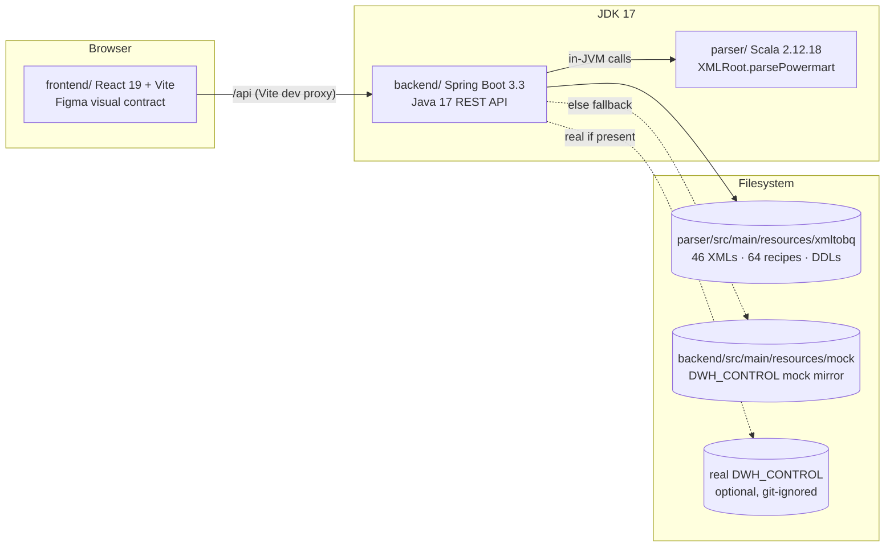

# ETL 360 Suite — Foundation Design

**Date:** 2026-07-29
**Status:** Approved (brainstorming session with serna)
**Sub-project:** 1 of 6 (Foundation) — see Roadmap below

## 1. Context

The repo hosts a standalone Scala 2.12 parser that turns Informatica PowerCenter (IPC)
Powermart XML exports into platform-agnostic `_ETL_*.json` recipes, BigQuery DDL JSONs,
and SQL translations. A Figma Make prototype under `frontend/` (React 19 + Vite +
Tailwind v4) sketches a four-tab "ETL 360" GUI (Viewer, Modifier, Operational, DAG),
currently driven entirely by `frontend/src/mockData.ts`.

Goal of the overall initiative: a locally-run ETL 360 suite where the GUI shows,
edits, and operationally traces the real corpus under `xmltobq/`, with GCP deep links,
synthetic operational data for development, and spec-driven engineering practices.

### Roadmap (agreed decomposition)

Each sub-project gets its own spec → plan → implementation cycle:

| # | Sub-project | Delivers |
|---|-------------|----------|
| 1 | **Foundation (this spec)** | Backend REST API over the corpus, frontend data layer, real sidebar tree, dev harness, test infra, docs/ADR/CLAUDE.md restructure |
| 2 | IPC ETL Viewer | Tab 1 on real data: full XML coverage, canvas, search, detail panels |
| 3 | ETL Modifier | Tab 2: recipe editing, validation, save-to-disk, All-Expressions UI, git-based version history |
| 4 | Synthetic operational data | Mock `statements.sql` (LayerToLayerConfig), synthetic XML/JSON scenarios, operational CSV history generator |
| 5 | ETL Operational Table Relationships | Tab 3: relationship graph, operational cards, time navigation, GCP links |
| 6 | Project practices | Continuous: ADRs, skills/agents, docs standards (starts inside Foundation) |

Tab 4 (ETL DAG) remains future work; its Figma mock is reduced to a placeholder when
Tab sub-projects land (not in Foundation).

## 2. Hard rules

1. **Figma visual contract.** The `frontend/` prototype's look — dark theme tokens in
   `src/index.css`, Inter/JetBrains Mono, component layout and interactions — is a hard
   visual contract. Rewiring swaps data sources only; no restyling, ever, without an
   explicit ask. Backend DTOs are shaped to fit the frontend's existing `types.ts`
   component contracts, not the other way around.
2. **Corpus safety.** `xmltobq/` is anonymized sample data; outputs are written next to
   inputs. Experiments run against temp copies. `DWH_CONTROL/` stays git-ignored and is
   never committed.
3. **Parser behavior unchanged.** Foundation moves the parser into a Maven module but
   does not change its behavior. Recipe generation output must be byte-identical.

## 3. Architecture



### Repo layout (multi-module Maven)

```
pure-scala-ipc-360/
├── pom.xml          # parent aggregator (packaging: pom), JDK 17 toolchain
├── parser/          # existing Scala 2.12.18 code + resources, moved verbatim
│   ├── pom.xml      # compiles at target 11, behavior unchanged
│   └── src/main/resources/xmltobq/       # corpus moves with the module
├── backend/         # NEW: Spring Boot 3.3, Java 17, depends on parser
│   ├── pom.xml
│   └── src/main/java/io/pure360/etl360/  # controllers, services, adapters
│   └── src/main/resources/mock/          # committed DWH_CONTROL mock mirror (created in sub-project 4; dir + fallback logic exist from Foundation)
├── frontend/        # existing prototype, unchanged location and look
├── docs/
│   ├── adr/                              # MADR-style ADRs
│   ├── architecture.md                   # diagrams (mermaid), component map
│   └── superpowers/{specs,plans}/        # spec-driven development artifacts
├── scripts/         # harness helpers
└── Makefile         # dev/test/build/check/regen-corpus
```

Decisions already made (each becomes an ADR during implementation):

- **ADR-0001** Multi-module Maven with a Spring Boot 3 (Java 17) backend reusing the
  Scala parser in-JVM. Rejected: Spring Boot 2.7 on Java 11 (EOL framework), Node
  sidecar (duplicates Powermart semantics, diverges from the Spring Boot requirement).
- **ADR-0002** XML fidelity via *generic DOM + semantic overlay* (see §4). Rejected:
  extending the Scala model to full coverage (high risk to the production parser,
  silent-miss risk), raw XML to the browser (duplicated semantics, heavy client parses).
- **ADR-0003** Synthetic operational data lives in a committed mock mirror; backend
  reads real `DWH_CONTROL/` when present, else falls back. Rejected: generating into
  the git-ignored dir (nothing versioned), backend-only mocks (no reusable files).
- **ADR-0004** Frontend TS types generated from the backend OpenAPI spec.
- **ADR-0005** Figma visual contract (hard rule 1).

### Why filesystem, not classpath

The backend reads the corpus from a configurable filesystem path (default:
`parser/src/main/resources/xmltobq` relative to the repo root). The corpus is a live
working directory — generated outputs sit next to input XMLs, and sub-project 3
(Modifier) writes recipes back. Classpath resources would be read-only and invisible
to git tooling.

## 4. Backend API (v1, read-only in Foundation)

All endpoints under `/api`. Path parameters `{**path}` are corpus-relative paths
(e.g. `CDM/m_DM_INFOHUB_BIZLINK`). Responses are JSON, UTF-8.

| Endpoint | Purpose |
|---|---|
| `GET /api/tree` | Full corpus tree: layer dirs (CDM, DWH, ETL, ODS, …, incl. nested folders like `ODS/BPM_74674_1/`), XML files, generated output dirs, per-node metadata (layer badge, file size, mtime, has-recipe/has-ddl flags) |
| `GET /api/mappings/{**path}/dom` | Lossless generic XML→JSON of the Powermart file: `{name, attributes, text?, children[]}` recursively. Every element and attribute is present by construction — this is the full-fidelity guarantee for the Viewer |
| `GET /api/mappings/{**path}/model` | Semantic model produced by calling the parser module in-JVM: repository/folder metadata, sources, targets, mappings, mapplets, transformations with typed ports (name, datatype, precision, scale, in/out, expression), connectors (from/to instance+port), session-level attributes present in the XML |
| `GET /api/recipes/{**path}` | Content of an `_ETL_*.json` recipe plus file metadata (size, mtime). Preserves `SOURCE_NAME.FIELD_NAME` dot notation untouched |
| `GET /api/ddl/{**path}` | All `<TABLE>.json` BigQuery DDL files in a mapping's output dir, keyed by table name |
| `GET /api/expressions` | Cross-corpus "All Expressions" archive: every expression found in the semantic models (from XML) and in `_ETL_*.json` recipes, tagged with its origin — `{mappingPath, transformation, port, formula, layer, origin: "xml"\|"recipe"}` — for reuse in the Modifier |
| `GET /api/config` | Sanitized runtime config for the frontend: GCP project id/region, URL templates (Dataproc cluster/job, Logging), data mode (`real`/`mock`) per source |
| `GET /api/health` | Liveness + corpus stats (XML count, recipe count, corpus root, last scan) |

### Behavior

- **Caching:** in-memory cache keyed by file path + mtime. A changed file is re-read
  on next request; no restart needed. No TTL logic beyond mtime comparison.
- **Data-source fallback:** a `DataRoots` component resolves each configured root:
  real path if it exists, else mock mirror, exposing which mode is active (surfaced in
  `/api/config` and `/api/health`). Foundation ships the mechanism; sub-project 4
  populates the mock mirror.
- **Path safety:** all `{**path}` values are normalized and must resolve inside the
  corpus root; otherwise 400. No writes in Foundation.
- **OpenAPI:** springdoc-openapi serves `/v3/api-docs` (and Swagger UI in dev).

### Configuration (`backend/src/main/resources/application.yml`)

Relative paths are resolved against the **repo root**, which the backend auto-detects
at startup (walks up from the working directory to the first dir containing the parent
`pom.xml`); absolute paths are taken as-is.

```yaml
etl360:
  corpus-root: ${ETL360_CORPUS_ROOT:parser/src/main/resources/xmltobq}
  dwh-control-root: ${ETL360_DWH_CONTROL_ROOT:parser/src/main/resources/DWH_CONTROL}   # optional, git-ignored
  mock-root: ${ETL360_MOCK_ROOT:backend/src/main/resources/mock}
  composer-root: ${ETL360_COMPOSER_ROOT:parser/src/main/resources/composer}
  gcp:
    project-id: ${ETL360_GCP_PROJECT:db-dev-example-project}
    region: ${ETL360_GCP_REGION:europe-southwest1}
    dataproc-job-url: "https://console.cloud.google.com/dataproc/jobs/{jobId}?project={project}&region={region}"
    dataproc-cluster-url: "https://console.cloud.google.com/dataproc/clusters/{clusterName}?project={project}&region={region}"
    logging-url: "https://console.cloud.google.com/logs/query;query=resource.labels.job_id%3D%22{jobId}%22?project={project}"
```

Every value overridable by `ETL360_*` env vars; a committed `.env.example` documents
them. The frontend receives only what `/api/config` exposes — no GCP values are
hardcoded client-side.

### Implementation deviations

- **Endpoint segment order.** The mapping endpoints ship as
  `/api/mappings/dom/{*path}` and `/api/mappings/model/{*path}` — verb before the path
  variable — not `/api/mappings/{**path}/dom` as sketched in the table above. Spring
  MVC only allows `{*var}`-style path variables as the trailing segment of a mapping
  pattern, so a fixed verb can't follow one.
- **`/api/expressions` origin.** Foundation ships `origin: "xml"` entries only —
  extracted from XML DOMs, one per non-identity `TRANSFORMFIELD` expression. Recipe-side
  extraction (`origin: "recipe"`) is deferred: the committed recipe JSONs have
  anonymizer-renamed keys (see root `CLAUDE.md` corpus caveats), which makes
  recipe-side expression extraction unreliable without further normalization work.
  Revisit in sub-project 3 (ETL Modifier). The DTO already carries the `origin` field.
- **DDL exclusion widened.** `/api/ddl/{*path}` was specified to exclude `_ETL_*` and
  `_sqlTranslations*` files from the DDL map. Implementation widened this to excluding
  **all** filenames starting with `_` — a literal `_sqlTranslations` prefix check
  missed anonymizer-mangled translation files (e.g. `_WESTPOND_ETL_*`) that leaked as
  spurious DDL keys across 18 mappings. Real DDL files are always `TABLE_NAME.json`
  and never start with `_`, so the wider rule has no false negatives.
- **Health/config surfacing landed one task later than planned.** `dwhControlMode`
  and `composerMode` in `GET /api/health` (this section already promised them) were
  added in the same commit as `/api/config`, one task after the initial health
  endpoint shipped with placeholder zero counts — see
  `docs/superpowers/plans/2026-07-29-etl360-foundation.md` Tasks 2 and 8.

## 5. Frontend data layer

- `frontend/src/api/`:
  - `types.gen.ts` — generated by `openapi-typescript` from `/v3/api-docs`
    (npm script `generate:api`; generated file is committed so the frontend builds
    without a running backend).
  - `client.ts` — thin typed fetch wrapper (base `/api`, JSON, problem+json error
    parsing).
  - `queries.ts` — TanStack Query hooks (`useTree()`, `useMappingDom(path)`,
    `useMappingModel(path)`, `useRecipe(path)`, `useDdl(path)`, `useExpressions()`,
    `useAppConfig()`).
- **TanStack Query** (`@tanstack/react-query`) is the single new runtime dependency:
  uniform caching/loading/error handling now, mutations + invalidation ready for the
  Modifier.
- **Vite dev proxy** in `vite.config.ts`: `/api` → `http://localhost:8080`.
- **Sidebar tree goes real:** driven by `useTree()`, with identical layer badges,
  colors, expand/collapse, and active states; top-bar search filters the real tree.
  Loading and error states use existing tokens (spinner/dim text, red accent for
  errors) — visually consistent with the prototype.
- **Tabs unchanged:** all four tabs keep rendering from `mockData.ts`, which gets a
  header comment marking it legacy-until-rewired. Nothing else in the tabs changes.
- `frontend/AGENTS.md` / `frontend/CLAUDE.md` rewritten: local dev via `make dev` or
  `npm run dev` + backend, no Figma Make assumptions.

## 6. Error handling

- Backend: global `@RestControllerAdvice` returning RFC 7807 `application/problem+json`
  — `{type, title, status, detail, instance}`. 404 for unknown paths with a
  human-readable `detail` ("No mapping at CDM/foo; nearest existing: …"), 400 for
  path-traversal or malformed paths, 500 with correlation id logged server-side.
  SAX parse failures on damaged XML return 422 with the SAX message and a hint about
  anonymizer entity damage (a known corpus caveat).
- Frontend: the fetch client converts problem+json into typed `ApiError`; queries
  surface `error.title/detail` in existing-style banners and empty states. No silent
  failures; retry affordance where the prototype has a natural spot for it.

## 7. Testing (TDD from here on)

| Layer | Tools | What |
|---|---|---|
| Backend unit | JUnit 5, AssertJ | DOM converter, path safety, DataRoots fallback, expression aggregation |
| Backend slice | Spring Boot Test + MockMvc | Each controller: happy path, 404, 400, problem+json shape |
| **Corpus contract** | JUnit 5 (tagged `corpus`) | Every XML in the corpus serves `/dom` and `/model` with 200 and non-empty bodies; recipe/DDL enumeration matches filesystem counts (46 XMLs → 46 models; 64 recipes readable). Replaces the manual smoke check |
| Parser regression | JUnit wrapper | Recipe regeneration into a temp dir produces the same file set as before the module move (behavior-unchanged guarantee) |
| Frontend unit/component | Vitest, React Testing Library, MSW | API client error mapping, tree rendering/search/expand, query hooks against mocked API |
| E2E | — | Deferred until tab sub-projects (Playwright candidate) |

TDD applies to all new backend/frontend code: red → green → refactor, enforced through
the implementation plan's task structure.

### Implementation deviations

- **Parser regression is not a standing JUnit harness.** The "behavior-unchanged
  guarantee" above is realized as a one-time pre/post-move byte-diff (Task 1: full
  corpus regenerated into a temp dir before the `parser/` move, regenerated again
  after, `diff -r` confirmed identical) plus the ongoing corpus contract test
  (`CorpusContractTest`, ≥59 mappings serving DOM+model, ≥64 recipes serving — see §4
  table). There is no permanent "regenerate and diff on every CI run" JUnit wrapper;
  the module-move risk it guarded against is a one-time event, already proven safe.
- **Corpus is 59 XMLs, not 46 (final-review correction).** The plan's "46 XMLs"
  premise (and this spec's own count callouts above and in §11) assumed every corpus
  mapping XML has a lowercase `.xml` extension. The real corpus is 46 `.xml` + 13
  `.XML` (case-insensitive filesystem search: `find … -iname '*.xml'` → 59; the Scala
  parser already treats the extension case-insensitively by design,
  `ScalaFileUtils.getAllFilesWithExtension`). The plan's `CorpusService` code snippet
  (and the shipped implementation, pre-fix) matched `.xml` case-sensitively —
  `name.endsWith(".xml")` — silently dropping the 13 `.XML` mappings from `/api/tree`,
  `/api/health`'s `xmlCount`, and the expressions archive, and undercounting the corpus
  contract test's floor at 46/59. Corrected post-final-review: `CorpusService` and
  `PathResolver` now match/resolve `.xml`/`.XML` case-insensitively (two-candidate
  check in `PathResolver`, so it holds on case-sensitive filesystems too), and the
  corpus contract test's floor is ≥59.

## 8. Dev harness

Root `Makefile` (thin, delegating to `scripts/` where logic is needed):

- `make dev` — backend (`mvn -pl backend spring-boot:run`) + frontend (`npm run dev`)
  concurrently with prefixed, colorized logs; Ctrl-C stops both.
- `make test` / `make test-backend` / `make test-frontend` — full and per-side tests.
- `make check` — formatting (oxfmt), type-check (tsc), lint, all tests. CI-ready.
- `make build` — `mvn package` + `vite build`.
- `make regen-corpus` — copies corpus XMLs to a temp dir, runs the XMLParser CLI over
  the copy (never in place), reports diff vs committed outputs.
- `make generate-api` — refresh `types.gen.ts` from a running backend.

Prerequisites documented in root README: JDK 17, Maven, Node 20+, pnpm/npm.

## 9. Docs & practices (starts here, continues as sub-project 6)

- **Root `CLAUDE.md` rewrite:** multi-module layout, build/run matrix, hard rules
  (visual contract, corpus safety, derived SQL artifacts, DWH_CONTROL), pointers to
  package docs, ADRs, and specs. Existing corpus caveats preserved verbatim where
  still true; paths updated for the `parser/` move.
- **ADR archive:** `docs/adr/` with an MADR-style template (`0000-template.md`) and
  ADRs 0001–0005 listed in §3. New architectural decisions require an ADR.
- **Specs & plans:** this file starts `docs/superpowers/specs/`; implementation plans
  go to `docs/superpowers/plans/`.
- **`docs/architecture.md`:** mermaid component + data-flow diagrams (consistent
  colors per component across all docs), endpoint table, config reference.
- **Project skills:** `.claude/skills/` for recurring workflows — run-the-app,
  regen-corpus safely, docs upkeep (diagram/screenshot conventions). Defined during
  implementation as thin wrappers over the Makefile targets.

## 10. Out of scope (Foundation)

- Any tab rewiring beyond the sidebar tree (sub-projects 2, 3, 5).
- Write endpoints, recipe validation, git version history (sub-project 3).
- Relationship graph and operational endpoints, `statements.sql` parsing, CSV
  ingestion, TimePicker data (sub-projects 4–5).
- Synthetic data content: mock mirror population, synthetic XML/JSON scenarios,
  operational CSV generator (sub-project 4).
- Tab 4 DAG work, GCP deployment, authentication (local-only, binds localhost).

## 11. Acceptance criteria

1. `make dev` starts both apps; the GUI is visually identical to the Figma prototype.
2. The sidebar shows the real `xmltobq/` tree (all layers, nested folders, 46 XMLs);
   search filters it; clicking behaves as in the prototype.
3. `curl` of every §4 endpoint returns documented shapes; the corpus contract test
   passes: 46/46 models, 46/46 DOMs, 64/64 recipes, DDL enumeration complete.
4. Recipe regeneration before/after the module move produces identical output files.
5. `make check` is green: backend tests, frontend tests, type-check, lint, format.
6. CLAUDE.md, README, `docs/adr/` (5 ADRs), `docs/architecture.md` exist and match
   reality; `frontend/AGENTS.md` no longer claims a Figma Make environment.
7. No visual regressions: side-by-side of prototype vs Foundation build shows
   identical rendering of all four tabs (still mock-fed) and the top bar.

## 12. Risks & mitigations

| Risk | Mitigation |
|---|---|
| Module move breaks parser paths/docs | Parser regression test (§7); doc-path sweep in the same PR |
| Scala 2.12 on JDK 17 surprises | Corpus contract test exercises the parser through the backend on JDK 17 from day one |
| Large XML (~1.9 MB) DOM JSON payloads | Lazy per-mapping fetch; mtime cache; measure — if a payload stalls the Viewer later, add child-pruning query params in sub-project 2 |
| OpenAPI-generated types drift from committed file | `make generate-api` starts the backend if needed, regenerates `types.gen.ts`, and `make check` fails on an uncommitted diff; workflow documented in README |
| Figma visual drift during data wiring | Acceptance criterion 7; visual contract rule in CLAUDE.md and memory |
