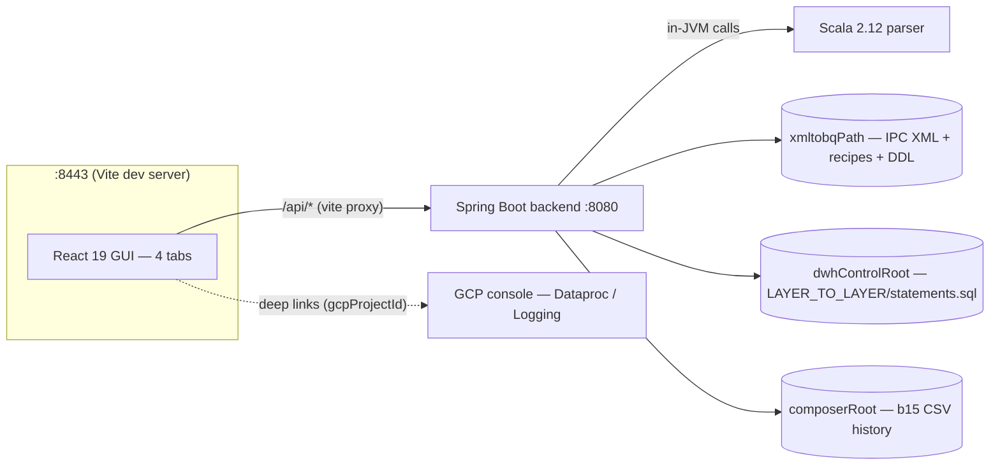
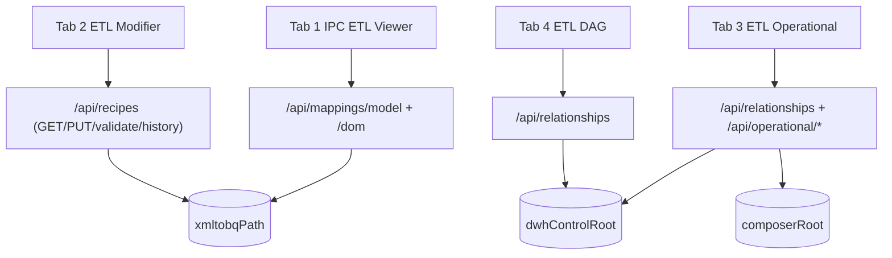
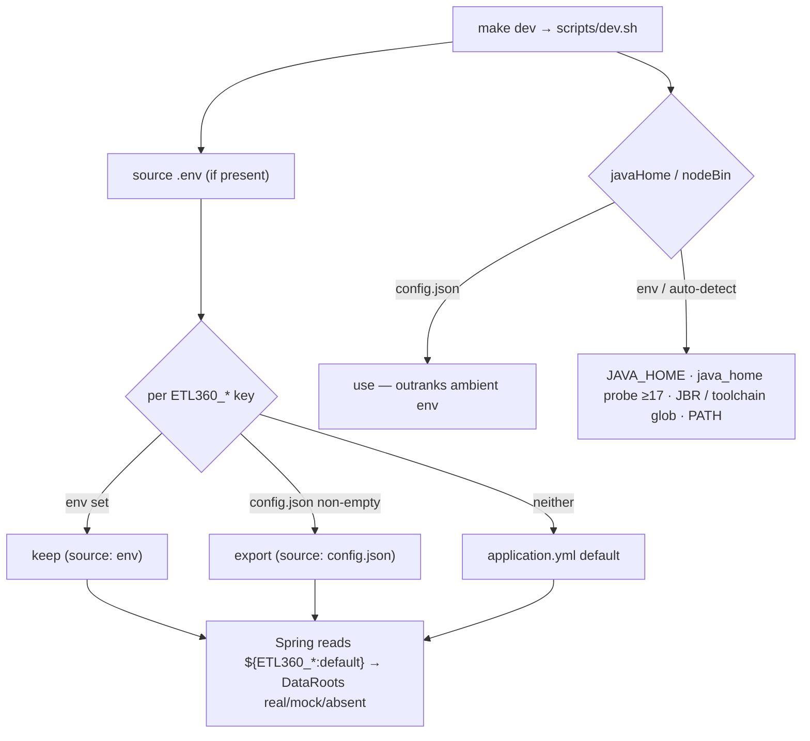
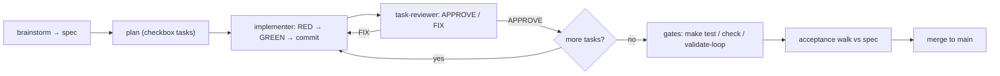

# Visual Guide

What ETL 360 looks like and how its pieces fit together: four diagrams — suite
architecture, per-tab data flow, `config.json` resolution, and the SDD/TDD harness
loop — followed by screenshots of the running app.

This doc owns the diagrams; nothing else in the repo duplicates them. The root
`README.md` links here for the visual overview, and `docs/harness.md` links here (its
§4, "Loop layering") for the harness-loop diagram instead of drawing its own.

## §1 Suite architecture

The frontend never talks to the parser or the data roots directly — everything goes
through the backend's read-only REST API. `gcpProjectId` (from `config.json`) only
ever builds outbound deep links into the GCP console; it isn't a credential the suite
uses to call GCP itself.

## §2 Data flow per tab

Each tab owns a distinct slice of the API; `/api/relationships` is the one endpoint two
tabs (3 and 4) share, and `xmltobqPath` is the one data root two endpoints (mappings
and recipes) share.

## §3 config.json resolution (per ADR-0009)

Two independent resolution orders, both driven from the same `scripts/dev.sh` entry
point: data-root env vars layer `env > config.json > application.yml default`, while
toolchain paths (`javaHome`/`nodeBin`) let `config.json` outrank ambient environment —
a pinned toolchain shouldn't lose to whatever happens to be on `PATH`.

## §4 SDD/TDD harness loop

The `implementer` → `task-reviewer` fix-loop repeats per task until `APPROVE`; only
once every task in the plan has cleared it do the repo-wide gates and the spec
acceptance walk run, before merge. See `docs/harness.md` for what each stage's
subagent contract and gate actually check.

## Screenshots

The seven screenshots below are captured from the running, merged app (this branch's
gated Task 6, after Tasks 1–5 land) — Chrome at roughly 1440×900, backend and frontend
both booted via `make dev`. Until Task 6 lands, the links below are scaffolding: the
images don't exist in `docs/img/` yet.

## Screenshot: Tab 1 — IPC ETL Viewer

Tab 1, `CDM/m_DM_INFOHUB_BIZLINK` rendered.

## Screenshot: Tab 2 — ETL Modifier

Recipe canvas + palette.

## Screenshot: Tab 3 — ETL Operational

Tab 3 default view.

## Screenshot: Tab 4 — ETL DAG

Tab 4 default view.

## Screenshot: Explorer collapsed

Any tab, Explorer collapsed to the slim rail.

## Screenshot: ETL Modifier mid-edit

Tab 2 mid-edit — SaveBar counting, formula textarea open.

## Screenshot: ETL Operational preview overlay

Tab 3 with the preview overlay open.
