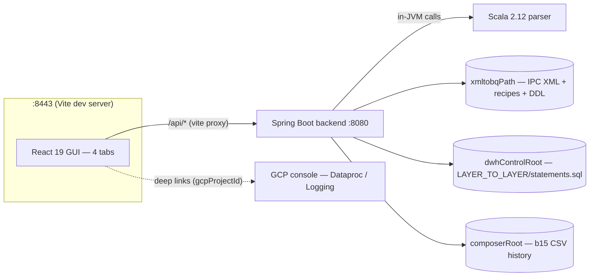
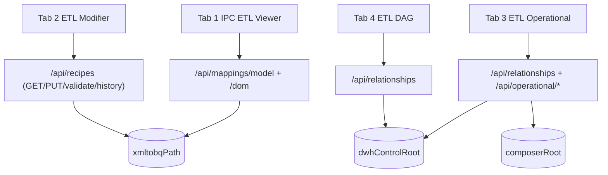
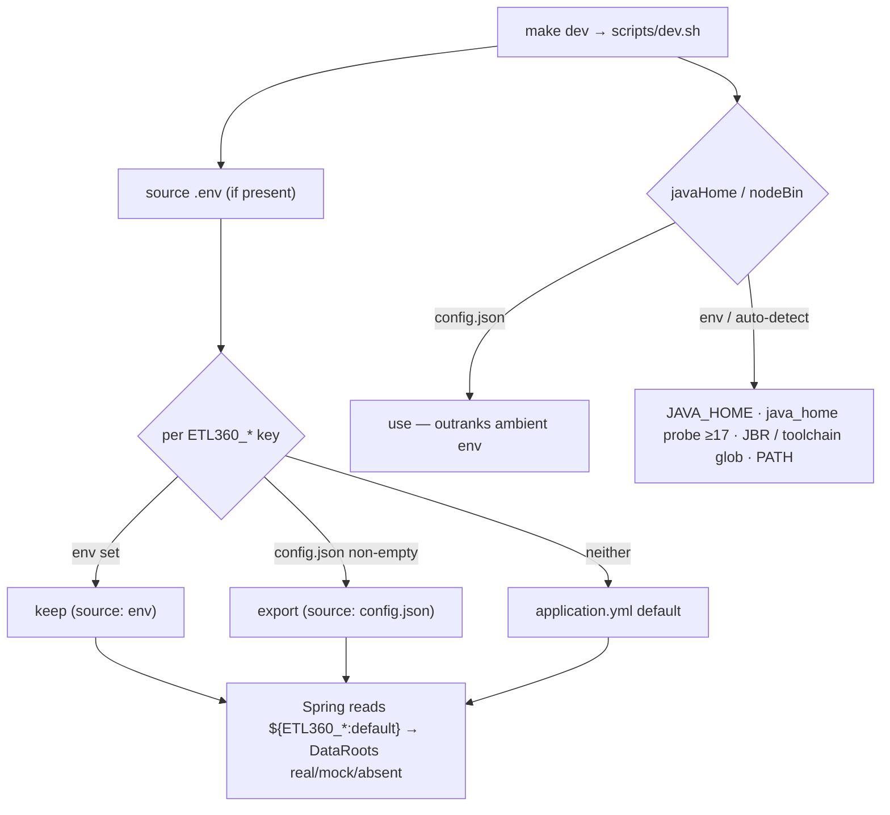
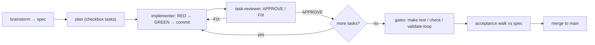

# Visual Guide

What ETL 360 looks like and how its pieces fit together: four diagrams — suite
architecture, per-tab data flow, `config.json` resolution, and the SDD/TDD harness
loop — followed by screenshots of the running app.

This doc owns the diagrams; nothing else in the repo duplicates them. The root
`README.md` links here for the visual overview, and `docs/harness.md` links here (its
§4, "Loop layering") for the harness-loop diagram instead of drawing its own.

## §1 Suite architecture

The frontend never talks to the parser or the data roots directly — everything goes
through the backend's read-only REST API. `gcpProjectId` (from `config.json`) only
ever builds outbound deep links into the GCP console; it isn't a credential the suite
uses to call GCP itself.

## §2 Data flow per tab

Each tab owns a distinct slice of the API; `/api/relationships` is the one endpoint two
tabs (3 and 4) share, and `xmltobqPath` is the one data root two endpoints (mappings
and recipes) share.

## §3 config.json resolution (per ADR-0009)

Two independent resolution orders, both driven from the same `scripts/dev.sh` entry
point: data-root env vars layer `env > config.json > application.yml default`, while
toolchain paths (`javaHome`/`nodeBin`) let `config.json` outrank ambient environment —
a pinned toolchain shouldn't lose to whatever happens to be on `PATH`.

## §4 SDD/TDD harness loop

The `implementer` → `task-reviewer` fix-loop repeats per task until `APPROVE`; only
once every task in the plan has cleared it do the repo-wide gates and the spec
acceptance walk run, before merge. See `docs/harness.md` for what each stage's
subagent contract and gate actually check.

## Screenshots

**Not yet captured.** Task 6 checked this environment for browser automation
(Claude-in-Chrome, Playwright, Puppeteer) and found none wired up — reaching each named
UI state well enough to screenshot it needs GUI interaction no tool here can perform, so
rather than fake it, this section is an honest checklist for a human with a working
Chrome to run. The seven `docs/img/*.png` files below don't exist yet; each `![...]`
link is left in place so dropping a same-named PNG into `docs/img/` later makes it
render with no further doc edits.

### Capture checklist (~5 minutes)

1. `make dev`, open Chrome at `http://localhost:8443`, size the window to roughly
   1440×900.
2. For each numbered screenshot below: put the UI in the described state, then run
   `screencapture -x -o docs/img/<file>.png` and click the target Chrome window when
   the crosshair cursor appears (`-x` suppresses the shutter sound, `-o` omits the
   window shadow).
3. Verify: `file docs/img/*.png` reports "PNG image data" for all 7; combined size
   under ~3 MB (`du -sh docs/img`). Then `git add docs/img docs/visual-guide.md` and
   commit.

### 1. Tab 1 — IPC ETL Viewer

State: `CDM/m_DM_INFOHUB_BIZLINK` selected. Save as `docs/img/tab1-viewer.png`.

Tab 1, `CDM/m_DM_INFOHUB_BIZLINK` rendered.

### 2. Tab 2 — ETL Modifier

State: recipe canvas + designer palette visible. Save as `docs/img/tab2-modifier.png`.

Recipe canvas + palette.

### 3. Tab 3 — ETL Operational

State: default view. Save as `docs/img/tab3-operational.png`.

Tab 3 default view.

### 4. Tab 4 — ETL DAG

State: default view. Save as `docs/img/tab4-dag.png`.

Tab 4 default view.

### 5. Explorer collapsed

State: any tab, Explorer collapsed to the slim rail. Save as
`docs/img/sidebar-collapsed.png`.

Any tab, Explorer collapsed to the slim rail.

### 6. ETL Modifier mid-edit

State: Tab 2 mid-edit — SaveBar counting, formula textarea open. Save as
`docs/img/modifier-editing.png`.

Tab 2 mid-edit — SaveBar counting, formula textarea open.

### 7. ETL Operational preview overlay

State: Tab 3 with the preview overlay open. Save as
`docs/img/operational-preview-overlay.png`.

Tab 3 with the preview overlay open.
